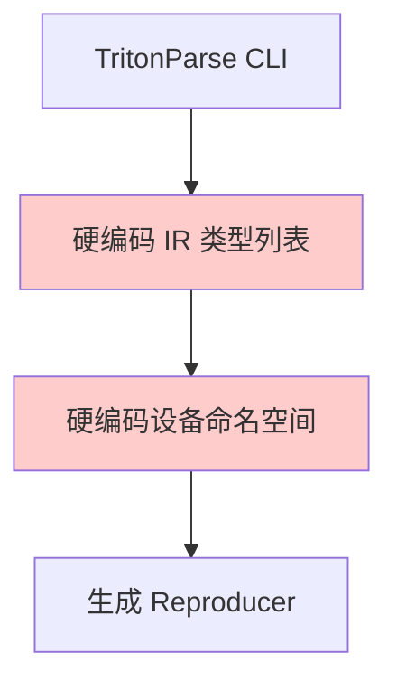
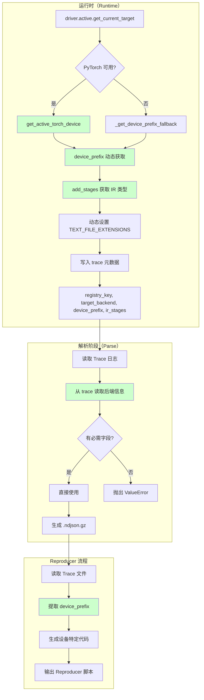
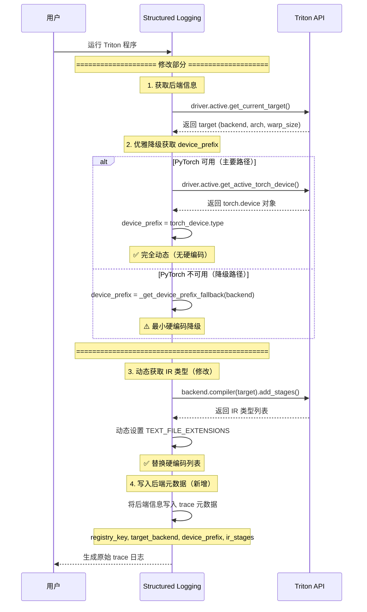
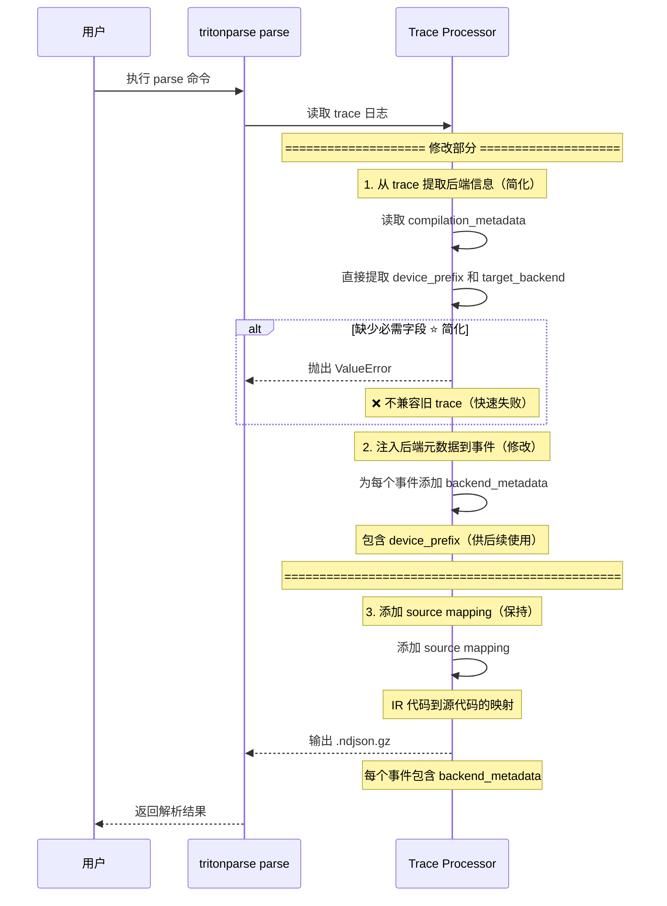
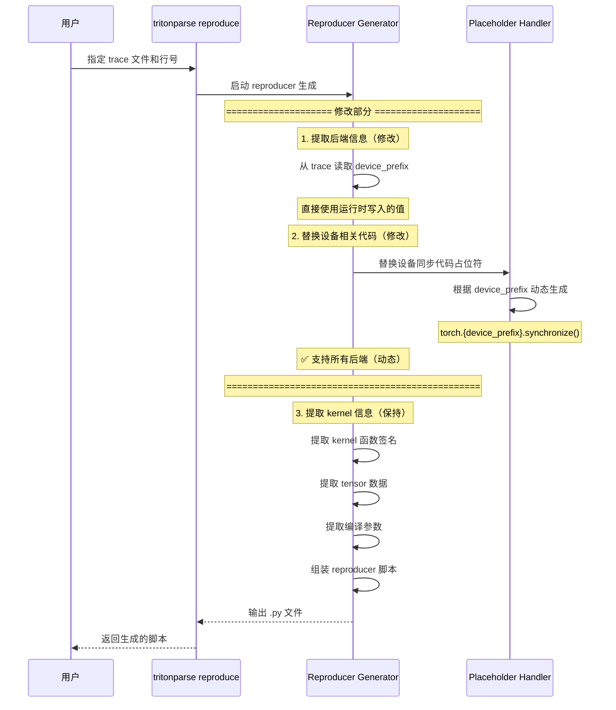

# RFC: TritonParse 后端通用化架构

**作者:**
* @zhudada0120

## 摘要

本 RFC 提议为 TritonParse 构建后端通用化架构。该设计利用 Triton 官方的 `BaseBackend.add_stages()` API（基于 Triton 3.5.1 版本验证）动态发现后端及其支持的 IR 类型及阶段能力，从 trace 元数据中提取后端信息，并实现完全元数据驱动的解析流程。关键改进包括：

- **明确区分三类后端标识符**：registry_key、target_backend、device_prefix（不再混用 backend_name）
- **动态发现四类阶段能力**：is_text、supports_source_mapping、mapping_kind、supports_bidirectional_mapping
- **trace 中写入完整的 IR 阶段能力信息**：包含所有能力字段的元数据
- **解析阶段根据 mapping_kind 动态选择解析器**：消除 `if stage_name in ["ptx", "amdgcn"]` 隐式硬编码
- **IR 内容读取符合实际 trace 结构**：通过 `artifact_key` 从 payload.file_content 或 payload.file_path 读取
- **IR 双向映射策略元数据化**：根据 supports_bidirectional_mapping 动态决策
- **优雅降级设计**：支持无 PyTorch 环境，有 PyTorch 时完全动态
- **派生产物来源显式建模**：使用 `stage_origin` 和 `derived_from` 描述 sass 等派生阶段
- **backend_metadata 字段语义统一**：使用 `target_backend` 与 `device_prefix`，不再混用模糊的 `name`
- **完整覆盖所有后端**：包括 NVIDIA、AMD、Ascend（ttadapter、bcmlir）
- **概念层和代码层完全一致**：可直接指导全量实现

## 动机

TritonParse 目前对 Triton 后端存在硬编码假设。IR 类型列表被硬编码为 `["ttir", "ttgir", "llir", "ptx", "cubin"]`，无法支持使用不同 IR 类型的新后端。例如 AMD 使用 `amdgcn`、`hsaco` 替代 `ptx`、`cubin`。同时，生成的 reproducer 总是使用 `device='cuda'` 和 `torch.cuda.synchronize()`，在非 CUDA 后端上会失效。

Triton 生态系统正在扩展到 NVIDIA 之外：
- **AMD ROCm**：官方 Triton 后端（backend="hip"，但 PyTorch 仍使用 "cuda" 命名空间以保持兼容性）
- **Ascend NPU**：[triton-ascend](https://github.com/Ascend/triton-ascend)（backend="npu"，使用独立的 `torch.npu.*` 命名空间）
- **未来后端**：通过 Triton 插件系统支持的 Intel、定制加速器

TritonParse 必须支持这种多后端现实，以保持作为通用 Triton 调试工具的实用性。

## 提议的实现

本设计遵循动态优先于静态的原则，从 Triton API 发现后端能力而非使用硬编码列表。通过自动检测后端并支持任何遵循 Triton `BaseBackend` 接口的后端，实现真正的后端通用化。

### 关键定义：三类后端标识符

为了避免命名混淆，本 RFC 明确定义以下三类标识符：

**1. registry_key**（后端注册表键）
- **用途**：在 Triton `backends` 注册表中查找后端
- **示例**：`"nvidia"`, `"amd"`, `"ascend"`
- **来源**：`from triton.backends import backends; backends.keys()`

**2. target.backend**（编译目标后端名）
- **用途**：传递给 `GPUTarget` 的后端标识
- **示例**：`"cuda"`, `"hip"`, `"npu"`
- **来源**：`driver.active.get_current_target().backend`

**3. device_prefix**（PyTorch 设备命名空间）
- **用途**：PyTorch 设备 API 调用前缀
- **示例**：`"cuda"`, `"npu"`
- **来源**：`driver.active.get_active_torch_device().type` 或降级映射

**映射关系表**：

| registry_key | target.backend | device_prefix | 后端名称 |
|--------------|----------------|----------------|----------|
| `"nvidia"` | `"cuda"` | `"cuda"` | NVIDIA CUDA |
| `"amd"` | `"hip"` | `"cuda"` | AMD ROCm |
| `"ascend"` | `"npu"` | `"npu"` | Ascend NPU |

**为什么需要分开**：
- `registry_key` → 用于在后端注册表中查找后端对象
- `target.backend` → 用于创建编译目标（GPUTarget）
- `device_prefix` → 用于生成 PyTorch 设备 API 调用
- 混用这些标识符会导致实现错误和混淆

### 架构对比

当前方案使用硬编码方式，IR 类型列表和设备命名空间都被固定在代码中，每添加新后端都需要修改代码。

新方案采用动态发现方式。在生成阶段使用 `triton.runtime.driver.active` 写入后端信息，在解析阶段从 trace 元数据读取后端信息，通过 `BaseBackend.add_stages()` 动态获取 IR 类型，并根据后端动态获取正确的设备命名空间。

#### 旧方案（硬编码方式）



**问题：**
- 红色标注部分为硬编码逻辑
- 每添加新后端需要修改代码
- IR 类型固定：`["ttir", "ttgir", "llir", "ptx", "cubin"]`
- 设备命名空间固定：`cuda`

#### 新方案（动态发现方式）- 总体架构



### 运行时阶段详细设计

运行时阶段负责在用户运行 Triton 程序时生成 trace 日志，并记录后端元数据。这是唯一使用 `driver.active` 和调用 `add_stages()` 的地方。



**运行时阶段关键步骤：**

1. **获取后端信息**
   - 调用 `triton.runtime.driver.active.get_current_target()` 获取硬件配置
   - 返回：`backend`、`arch`、`warp_size`

2. **优雅降级获取 device_prefix** ⭐ **新增**
   - **主要路径（有 PyTorch）**：
     - 调用 `driver.active.get_active_torch_device()`
     - 提取 `torch.device.type` 作为 device_prefix
     - 完全动态，无硬编码
   - **降级路径（无 PyTorch）**：
     - 使用 `_get_device_prefix_fallback(backend)`
     - 最小硬编码映射（cuda, hip, npu）
   - 这是**唯一**使用 `get_active_torch_device()` 的地方

3. **动态获取 IR 类型及能力** ⭐ **修改**
   - 调用 `backend.compiler(target).add_stages(Language.TRITON)`
   - 动态设置 `TEXT_FILE_EXTENSIONS`（只包含 `is_text=True` 的阶段）
   - **替换硬编码**：`[".ttir", ".ttgir", ".llir", ".ptx", ".amdgcn", ".json"]`
   - **新增能力判断**：
     - `mapping_kind`（决定解析器类型）
     - `supports_bidirectional_mapping`（决定是否参与 IR 间双向映射）

4. **写入后端元数据和阶段能力** ⭐ **新增**
   - 将后端信息写入 trace 的 `compilation_metadata`
   - 包含字段：
     - `registry_key`：后端注册表键（如 "nvidia", "amd"）
     - `target_backend`：编译目标后端名（如 "cuda", "hip", "npu"）
     - `device_prefix`：PyTorch 设备命名空间（如 "cuda", "npu"）
      - `ir_stages`：IR 阶段能力列表（每个阶段包含 `artifact_key`、`stage_origin`、`is_text`、`supports_source_mapping`、`mapping_kind`、`supports_bidirectional_mapping`）
     - `target`：硬件配置（backend, arch, warp_size）

**补充规则：派生产物与 payload 键模型**

1. `artifact_key` 是 payload 字典中的规范键，用于从 `payload.file_content` 与 `payload.file_path` 读取产物
2. backend 原生阶段的 `artifact_key` 默认等于 `name`
3. tritonparse 派生产物通过 `stage_origin="derived"` 标识；例如 NVIDIA 的 `sass` 由 `cubin` 额外反汇编得到，此时：
    - `name = "sass"`
    - `artifact_key = "sass"`
    - `stage_origin = "derived"`
    - `derived_from = "cubin"`
4. 解析阶段始终通过 `artifact_key` 取内容，不再假定 payload 键一定等于阶段名或文件名

---

### 解析阶段详细设计

解析阶段负责处理 trace 日志，从元数据中提取后端信息，并生成包含完整后端元数据的 trace 文件。解析阶段在离线环境中运行，不调用任何后端 API。



**解析阶段关键步骤：**

1. **从 trace 提取后端信息** ⭐ **简化**
   - 从 `compilation_metadata` 直接读取：
     - `device_prefix`：必需字段
     - `target_backend`：必需字段
     - `ir_stages`：阶段能力列表（用于选择解析器）
   - **不调用** `add_stages()`（IR 文件已存在于 trace）
   - **快速失败**：如果缺少必需字段，直接抛出 ValueError

2. **注入后端元数据到事件** ⭐ **修改**
   - 为每个 trace 事件添加 `backend_metadata` 字段
   - 包含 `device_prefix`（供 Reproducer 阶段使用）
   - 这是解析阶段的核心功能之一
   - **注意**：此时不使用 device_prefix，只是传递给后续阶段

3. **根据 mapping_kind 动态选择解析器** ⭐ **新增**
   - 从 `ir_stages` 读取每个阶段的 `mapping_kind`
   - 根据 `mapping_kind` 选择对应的解析器：
     - `"generic"` → 通用 loc 解析器（ttir, ttgir, llir）
     - `"ptx"` → 汇编格式解析器（ptx, amdgcn）
     - `"sass"` → 派生反汇编解析器（sass）
     - `"none"` → 不做 source mapping
   - **消除隐式硬编码**：不再使用 `if stage_name in ["ptx", "amdgcn"]` 判断

4. **添加 source mapping**（保持）
   - 为 IR 代码添加到源代码的映射
   - 便于在前端中显示源代码位置
   - 这是解析阶段的主要功能

5. **输出阶段**
   - 生成包含后端信息的 `.ndjson.gz` 文件
   - 每个事件都包含 `backend_metadata`
   - 后端元数据结构：
     ```json
     {
       "backend_metadata": {
                 "target_backend": "cuda",
         "device_prefix": "cuda"
       }
     }
     ```
         **说明**：`backend_metadata` 只保留 Reproducer 所需的最小字段，不再使用含义模糊的 `name`

**数据流向**：
```
运行时生成 .ndjson（包含 compilation_metadata + ir_stages）
    ↓
解析阶段提取后端信息，根据 mapping_kind 选择解析器
    ↓
添加 source mapping，注入 backend_metadata 到事件
    ↓
输出 .ndjson.gz（包含 backend_metadata）
    ↓
Reproducer 使用 device_prefix 生成设备特定代码
```

**解析阶段的完全元数据驱动实现**：
```python
def process_trace_event(trace_data: Dict) -> Dict:
    """完全元数据驱动的 trace 处理"""

    # 1. 从 trace 提取后端信息
    compilation_metadata = trace_data.get("compilation_metadata", {})
    device_prefix = compilation_metadata.get("device_prefix")
    target_backend = compilation_metadata.get("target_backend")
    ir_stages = compilation_metadata.get("ir_stages", [])

    # 2. 根据 mapping_kind 动态选择解析器
    for stage_info in ir_stages:
        if stage_info["is_text"] and stage_info["supports_source_mapping"]:
            stage_name = stage_info["name"]
            artifact_key = stage_info["artifact_key"]
            mapping_kind = stage_info["mapping_kind"]

            # ✅ 提取 IR 内容（符合实际 trace 结构）
            # IR 内容通过 artifact_key 存储在 payload.file_content 或 payload.file_path 中
            payload = trace_data.get("payload", {})
            if "file_content" in payload:
                ir_content = payload["file_content"].get(artifact_key)
            elif "file_path" in payload:
                # 从文件路径读取
                ir_path = payload["file_path"].get(artifact_key)
                if ir_path:
                    with open(ir_path, 'r') as f:
                        ir_content = f.read()
            else:
                ir_content = None

            if ir_content:
                # ✅ 根据 mapping_kind 选择解析器（消除硬编码）
                if mapping_kind == "ptx":
                    mappings = extract_ptx_amdgcn_mappings(ir_content)
                elif mapping_kind == "sass":
                    mappings = extract_sass_mappings(ir_content)
                elif mapping_kind == "generic":
                    mappings = extract_generic_loc_mappings(ir_content)
                else:
                    mappings = {}

                # 添加 source mapping
                add_source_mapping(trace_data, mappings, stage_name)

    # 3. 注入 backend_metadata 到事件
    trace_data.setdefault("backend_metadata", {
        "target_backend": target_backend,
        "device_prefix": device_prefix
    })

    return trace_data
```

---
### Reproducer 流程详细设计

Reproducer 功能负责从 trace 文件中提取内核信息，生成可独立运行的 reproducer 脚本。



**Reproducer 流程关键步骤：**

1. **从 .ndjson.gz 提取后端信息** ⭐ **修改**
   - **数据源**：从解析阶段输出的 .ndjson.gz 文件读取
   - **提取位置**：从每个事件的 `backend_metadata.device_prefix` 字段
   - **数据流向**：
     ```
     解析阶段注入 device_prefix 到事件
         ↓
     输出 .ndjson.gz（每个事件包含 backend_metadata）
         ↓
     Reproducer 从事件中读取 device_prefix
     ```
   - **之前**：根据 `target_backend` 映射到 `device_prefix`
   - **现在**：直接使用解析阶段准备好的 `device_prefix`
   - **优势**：
     - ✅ 无需维护映射关系
     - ✅ 支持所有后端（包括未来新增的）
     - ✅ 使用运行时确定的正确值
     - ✅ 职责分离清晰（解析准备，Reproducer 使用）

2. **替换设备相关代码** ⭐ **修改**
   - **之前**：硬编码为 `torch.cuda.synchronize()`
   - **现在**：根据 `device_prefix` 动态生成
   - **示例**：
     ```python
     # NVIDIA (device_prefix = "cuda")
     torch.cuda.synchronize()

     # AMD ROCm (device_prefix = "cuda")
     torch.cuda.synchronize()

     # Ascend NPU (device_prefix = "npu")
     torch.npu.synchronize()

     # 未来后端 (device_prefix = "xpu")
     torch.xpu.synchronize()
     ```
   - **优势**：自动支持所有后端，无需修改代码

3. **提取 kernel 信息**（保持）
   - 提取 kernel 函数签名
   - 提取 tensor 数据
   - 提取编译参数

4. **输出阶段**
   - 生成独立的 Python reproducer 脚本
   - 脚本中包含正确的设备 API 调用
   - 支持直接运行和调试

**与旧版本的对比**：

| 方面 | 旧版本 | 新版本 | 改进 |
|------|--------|--------|------|
| **device_prefix 来源** | 从 target_backend 映射 | 从 trace 直接读取 | ✅ 无需映射 |
| **设备同步代码** | 硬编码 `cuda` | 动态生成 | ✅ 支持所有后端 |
| **新后端支持** | 需要修改代码 | 自动支持 | ✅ 自动扩展 |

### 核心组件

#### 最终 Trace Schema 定义

**Compilation 事件结构**（以 NVIDIA 后端为例）：
```json
{
  "event_type": "compilation",
  "compilation_metadata": {
    "registry_key": "nvidia",
    "target_backend": "cuda",
    "device_prefix": "cuda",
    "ir_stages": [
      {
        "name": "ttir",
                "artifact_key": "ttir",
        "extension": ".ttir",
                "stage_origin": "backend",
        "is_text": true,
        "supports_source_mapping": true,
        "mapping_kind": "generic",
        "supports_bidirectional_mapping": true
      },
      {
        "name": "ptx",
                "artifact_key": "ptx",
        "extension": ".ptx",
                "stage_origin": "backend",
        "is_text": true,
        "supports_source_mapping": true,
        "mapping_kind": "ptx",
        "supports_bidirectional_mapping": true
      },
      {
        "name": "sass",
                "artifact_key": "sass",
        "extension": ".sass",
                "stage_origin": "derived",
                "derived_from": "cubin",
        "is_text": true,
        "supports_source_mapping": true,
        "mapping_kind": "sass",
        "supports_bidirectional_mapping": false
      }
    ],
    "target": {
      "backend": "cuda",
      "arch": 80,
      "warp_size": 32
    }
  },
  "payload": {
    "file_path": {
      "ttir": "/path/to/kernel.ttir",
      "ptx": "/path/to/kernel.ptx"
    },
    "file_content": {
      "ttir": "module { ... }",
      "ptx": ".version ..."
    }
  }
}
```

**注**：不同后端的 `ir_stages` 包含不同的阶段：
- **NVIDIA**：ttir, ttgir, llir, ptx, sass, cubin
- **AMD**：ttir, ttgir, llir, amdgcn, hsaco
- **Ascend**：ttir, ttgir, llir, ttadapter, bcmlir, npubin

**Launch 事件结构**：
```json
{
  "event_type": "launch",
  "compilation_metadata": {
    "registry_key": "nvidia",
    "target_backend": "cuda",
    "device_prefix": "cuda",
    "ir_stages": [...]
  },
  "backend_metadata": {
        "target_backend": "cuda",
    "device_prefix": "cuda"
  },
  "payload": {
    "grid": [16, 1],
    "kernel_name": "kernel"
  }
}
```

**字段说明**：
- `compilation_metadata`：运行时写入，包含完整的后端信息和阶段能力
- `backend_metadata`：解析阶段注入，简化版后端信息（供 Reproducer 使用）
    - `target_backend`：存储编译目标后端（cuda, hip, npu），**不是** registry_key
  - `device_prefix`：存储 PyTorch 设备命名空间（cuda, npu）
- `payload.file_path`：按 `artifact_key` 索引的 IR 文件路径
- `payload.file_content`：按 `artifact_key` 索引的 IR 文件内容（可选，某些场景下直接存储）

**重要**：`backend_metadata.target_backend` 统一存储编译目标后端（cuda, hip, npu），而不是 `registry_key`（nvidia, amd, ascend）。

**重要**：`ir_stages` 里的 `artifact_key` 是 payload 中查找内容的唯一规范键；`stage_origin` 用于区分 backend 原生阶段与 tritonparse 派生阶段。

---

#### 后端信息提取（从 trace）

新模块 `tritonparse/backends.py` 提供后端信息提取功能：

```python
from dataclasses import dataclass
from typing import Dict

@dataclass
class BackendInfo:
    """后端元数据（用于解析和 Reproducer 生成）"""
    target_backend: str          # 例如 "cuda", "hip", "npu"
    device_prefix: str           # PyTorch 命名空间："cuda", "npu"

def extract_backend_from_trace(trace_data: Dict) -> BackendInfo:
    """
    从 trace 元数据中提取后端信息。

    Args:
        trace_data: trace 文件的 JSON 数据

    Returns:
        BackendInfo 对象，包含后端名称和设备前缀

    Raises:
        ValueError: 如果 trace 中缺少后端信息
    """
    compilation_metadata = trace_data.get("compilation_metadata", {})

    # 直接读取必需字段
    device_prefix = compilation_metadata.get("device_prefix")
    backend = compilation_metadata.get("target_backend")

    # 缺少必需字段时抛出异常
    if not backend or not device_prefix:
        raise ValueError(
            "Trace 文件缺少后端信息（需要 device_prefix 和 target_backend）。"
            "请确保使用支持后端元数据的 tritonparse 版本生成 trace 文件。"
        )

    return BackendInfo(
        target_backend=backend,
        device_prefix=device_prefix
    )

def _get_device_prefix_fallback(backend: str) -> str:
    """
    最小硬编码映射，仅在 PyTorch 不可用时的运行时使用。

    注意：解析阶段不使用此函数，直接从 trace 读取 device_prefix。

    这是可接受的硬编码，因为：
    - 仅在运行时无 PyTorch 环境中使用
    - 映射非常小（只包含已知后端）
    - 仅作为后备方案，优先使用动态 API
    - 集中在一个函数中易于维护

    Args:
        backend: Triton backend 名称（"cuda", "hip", "npu" 等）

    Returns:
        PyTorch 设备命名空间
    """
    mapping = {
        "cuda": "cuda",   # NVIDIA
        "hip": "cuda",    # AMD ROCm（特殊情况：底层用 hip，PyTorch 用 cuda）
        "npu": "npu",     # Ascend
    }
    # 默认返回 backend 本身（适用于未来后端）
    return mapping.get(backend, backend)
```

**关键设计决策**：
1. ✅ **解析阶段不调用 add_stages()**：解析阶段只处理已存在的 IR 文件，不需要知道 IR 类型列表
2. ✅ **从 trace 元数据提取**：唯一可靠的后端信息来源
3. ✅ **缺少信息时抛异常**：强制使用正确的 trace 文件，不兼容旧版本
4. ✅ **优雅降级**：仅在运行时 PyTorch 不可用时使用最小硬编码
5. ✅ **mapping_kind 消除隐式硬编码**：不再使用 `if stage_name in ["ptx", "amdgcn"]` 判断，根据元数据动态选择解析器
6. ✅ **四类能力字段分离关注点**：
   - `is_text` → 决定能否按文本读取
   - `supports_source_mapping` → 决定是否做 source mapping
   - `mapping_kind` → 决定用哪种解析器
   - `supports_bidirectional_mapping` → 决定是否参与 IR 间双向映射
7. ✅ **符合实际 trace 结构**：IR 内容从 `payload.file_content` 或 `payload.file_path` 读取
8. ✅ **统一字段命名**：只使用 registry_key、target_backend、device_prefix、ir_stages，不再混用 backend_name
9. ✅ **registry_key 概念完全贯彻**：代码中先映射 target.backend → registry_key，再查 backends

#### 元数据处理

修改 `tritonparse/parse/trace_processor.py`，从 trace 中提取后端信息并添加到元数据：

```python
from tritonparse.backends import extract_backend_from_trace

def process_trace_event(trace_data: Dict) -> Dict:
    """
    处理单个 trace 事件，提取并添加后端元数据。

    Args:
        trace_data: 从 .ndjson 文件读取的原始 trace 数据

    Returns:
        添加了后端元数据的 trace 数据

    Raises:
        ValueError: 如果 trace 中缺少后端信息
    """
    # 从 trace 元数据提取后端信息
    backend_info = extract_backend_from_trace(trace_data)

    # 将后端元数据添加到所有相关事件
    trace_data.setdefault("backend_metadata", {
        "target_backend": backend_info.target_backend,
        "device_prefix": backend_info.device_prefix
    })

    return trace_data
```

#### 生成阶段后端信息写入

修改 `tritonparse/structured_logging.py`，在生成 trace 时写入后端信息并动态设置 IR 文件扩展名：

```python
def init_with_backend_info(log_dir, ...):
    """
    初始化结构化日志，并在 trace 中记录后端信息。

    这是唯一使用 driver.active 和 add_stages() 的地方（运行时环境）。
    """
    from triton.runtime import driver
    from triton.backends import backends
    from triton.backends.compiler import Language

    # 获取当前活动后端
    active_driver = driver.active
    target = active_driver.get_current_target()

    # ✅ 优先使用 PyTorch API 动态获取设备命名空间
    try:
        torch_device = active_driver.get_active_torch_device()
        device_prefix = torch_device.type  # "cuda", "npu" 等
    except (ImportError, AttributeError):
        # ⚠️ PyTorch 不可用时，使用最小硬编码映射作为降级方案
        device_prefix = _get_device_prefix_fallback(target.backend)

    # ✅ 调用 add_stages() 获取 IR 类型及能力（修改）
    registry_key = _get_registry_key(target.backend)  # 先映射到 registry_key
    backend = backends[registry_key]                   # 再查 backends 注册表
    compiler = backend.compiler(target)
    options = compiler.parse_options({})

    stages = {}
    compiler.add_stages(stages, options, Language.TRITON)

    # ✅ 构建阶段能力信息（新增）
    ir_stages = []
    for stage_name, stage_fn in stages.items():
        stage_info = {
            "name": stage_name,
            "artifact_key": stage_name,
            "extension": f".{stage_name}",
            "stage_origin": "backend",
            "is_text": _is_text_stage(stage_name),
            "supports_source_mapping": _supports_source_mapping(stage_name),
            "mapping_kind": _get_mapping_kind(stage_name),
            "supports_bidirectional_mapping": _supports_bidirectional_mapping(stage_name)
        }
        ir_stages.append(stage_info)

    # ✅ 追加 tritonparse 派生产物（例如 NVIDIA 的 SASS）
    if _should_add_sass_stage(ir_stages):
        ir_stages.append({
            "name": "sass",
            "artifact_key": "sass",
            "extension": ".sass",
            "stage_origin": "derived",
            "derived_from": "cubin",
            "is_text": True,
            "supports_source_mapping": True,
            "mapping_kind": "sass",
            "supports_bidirectional_mapping": False,
        })

    # ✅ 动态设置 TEXT_FILE_EXTENSIONS（只包含文本阶段）
    TEXT_FILE_EXTENSIONS = [
        stage_info['extension']  # extension 已包含 "." 前缀
        for stage_info in ir_stages
        if stage_info['is_text']
    ]
    TEXT_FILE_EXTENSIONS.append(".json")  # 源代码文件

    # 将后端信息和阶段能力记录到 compilation_metadata
    compilation_metadata = {
        "registry_key": _get_registry_key(target.backend),  # ⭐ 新增
        "target_backend": target.backend,                    # ⭐ 明确命名
        "device_prefix": device_prefix,
        "ir_stages": ir_stages,                               # ⭐ 新增：阶段能力信息
        "target": {
            "backend": target.backend,
            "arch": target.arch,
            "warp_size": target.warp_size
        }
    }

    # 写入 trace 的 compilation 事件
    _write_compilation_metadata(compilation_metadata)

    return TEXT_FILE_EXTENSIONS, compilation_metadata
```

**关键改进**：
- ✅ 动态调用 `add_stages()` 获取 IR 类型列表
- ✅ 根据返回的 IR 类型动态设置 `TEXT_FILE_EXTENSIONS`
- ✅ 消除了硬编码的 `[".ttir", ".ttgir", ".llir", ".ptx", ".amdgcn", ".json"]`
- ✅ 自动支持任何后端的 IR 类型（包括未来新增的后端）
- ✅ 根据 `mapping_kind` 动态选择解析器，消除隐式硬编码
- ✅ 优雅降级：有 PyTorch 时完全动态，无 PyTorch 时使用最小硬编码

**阶段能力判断函数**：
```python
def _is_text_stage(stage_name: str) -> bool:
    """判断阶段是否为文本格式（最小硬编码）"""
    # IR 阶段（包括 PTX/AMDGCN/Ascend 汇编）
    TEXT_STAGES = {
        "ttir", "ttgir", "llir",      # Triton 通用 IR
        "ptx", "amdgcn",              # 汇编格式
        "ttadapter", "bcmlir",        # Ascend 特有 IR
        "sass"                        # 派生反汇编
    }
    return stage_name in TEXT_STAGES

def _get_mapping_kind(stage_name: str) -> str:
    """获取 mapping 解析器类型（最小硬编码）"""
    if stage_name in ["ptx", "amdgcn"]:
        return "ptx"           # 汇编格式解析器
    elif stage_name == "sass":
        return "sass"          # 派生反汇编解析器
    elif stage_name in ["ttir", "ttgir", "llir", "ttadapter", "bcmlir"]:
        return "generic"       # 通用 loc 解析器
    else:
        return "none"          # 不做 mapping

def _supports_source_mapping(stage_name: str) -> bool:
    """判断是否支持 source mapping"""
    return _get_mapping_kind(stage_name) != "none"

def _supports_bidirectional_mapping(stage_name: str) -> bool:
    """判断是否参与 IR 间双向映射"""
    # 派生产物不参与双向映射
    return stage_name != "sass"

def _should_add_sass_stage(ir_stages: list[dict]) -> bool:
    """当后端产物包含 cubin 时，追加 tritonparse 派生的 sass 阶段。"""
    return any(stage["name"] == "cubin" for stage in ir_stages)

def _get_registry_key(target_backend: str) -> str:
    """从 target.backend 推导 registry_key（最小硬编码）"""
    mapping = {
        "cuda": "nvidia",
        "hip": "amd",
        "npu": "ascend"
    }
    return mapping.get(target_backend, target_backend)
```

#### 感知后端的 Reproducer 生成

修改 `tritonparse/reproducer/placeholder_replacer.py`，使用检测到的后端命名空间生成设备特定代码：

```python
def _replace_device_sync(code, context_bundle):
    from tritonparse.backends import extract_backend_from_trace

    backend_info = extract_backend_from_trace(context_bundle.trace_data)
    device_prefix = backend_info.device_prefix

    sync_call = f"torch.{device_prefix}.synchronize()"
    return code.replace(DEVICE_SYNC_PLACEHOLDER, sync_call)
```


## 缺点

### 1. 最小硬编码仍然存在（但已最小化）

本方案仍然存在少量硬编码，但已经最小化到**可接受的范围**：

**硬编码的使用场景**：

1. **运行时降级映射**（`_get_device_prefix_fallback()`）
   - 使用场景：仅限 PyTorch 不可用时的运行时降级
   - 实际使用：大多数用户有 PyTorch → 完全动态；少数无 PyTorch 用户 → 最小硬编码

2. **阶段能力判断**（`_is_text_stage()`, `_get_mapping_kind()`）
   - 使用场景：判断 IR 阶段的能力（是否文本、使用哪种解析器）
   - 必要性：
     - **Triton API 不提供这些能力信息**，需要根据已知后端的最小硬编码
     - **未知后端自动降级**：默认 `mapping_kind="none"`，不做 source mapping
     - **集中维护**：所有硬编码集中在 3 个函数中，易于更新
   - 对比旧方案：
     - 旧方案：硬编码阶段名列表散落在多个地方（`TEXT_FILE_EXTENSIONS`、解析器选择等）
     - 新方案：硬编码集中在运行时的能力判断函数，解析阶段完全元数据驱动

**为什么这是可接受的**：
- ✅ **主要路径完全动态**：有 PyTorch 时，`device_prefix` 完全动态获取
- ✅ **未知后端自动支持**：`_get_device_prefix_fallback()` 和 `_get_mapping_kind()` 对未知后端返回合理默认值
- ✅ **集中维护**：硬编码只集中在 3 个函数中，添加新后端只需更新这 3 个函数
- ✅ **解析阶段无硬编码**：解析阶段根据元数据动态选择解析器，不包含任何阶段名判断

**旧方案 vs 新方案对比**：

| 方面 | 旧方案 | 新方案 |
|------|--------|--------|
| **TEXT_FILE_EXTENSIONS** | 硬编码列表 | 动态从 add_stages() 生成 |
| **解析器选择** | `if stage_name in ["ptx", "amdgcn"]` | 根据 mapping_kind 动态选择 |
| **device_prefix** | 总是硬编码 | 有 PyTorch 时动态，无 PyTorch 时降级 |
| **硬编码位置** | 散落在多个文件 | 集中在 3 个函数 |
| **新后端支持** | 需要修改多处代码 | 只需更新 3 个函数 |

---

### 2. 阶段能力判断需要手动维护（但已最小化影响）

`_is_text_stage()` 和 `_get_mapping_kind()` 函数需要根据已知后端的 IR 类型手动维护。

**影响范围**：
- ✅ **只在运行时使用**：不影响解析阶段
- ✅ **降级策略友好**：未知阶段默认为 `mapping_kind="none"`
- ✅ **集中维护**：添加新后端或新阶段时，只需更新这 2 个函数

**为什么不需要完全自动化**：
- Triton 官方 API 不提供阶段能力信息
- 不同后端的 IR 类型差异很大，难以推断
- 手动维护 3 个函数的代价远小于硬编码散落各处的代价

---

### 3. 旧 trace 文件不兼容

如果 trace 文件中缺少后端元数据（`device_prefix` 或 `target_backend`），解析时会直接抛出 ValueError。

**这是有意为之的设计**：
- ✅ 强制用户使用新版本 tritonparse 重新生成 trace
- ✅ 快速失败（fail fast），让问题立即暴露
- ✅ 避免维护新旧兼容的复杂逻辑
- ✅ 简化代码，提高可维护性

**升级路径**：
- 用户升级 tritonparse 后，重新运行一次 Triton 程序生成新的 trace
- 一次性迁移成本，换来长期简洁的代码
