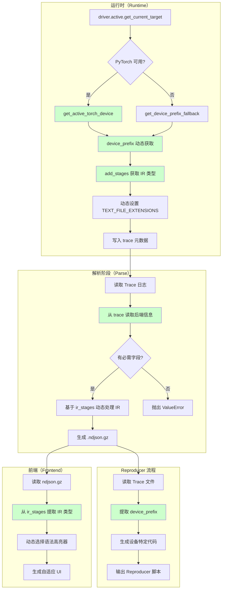
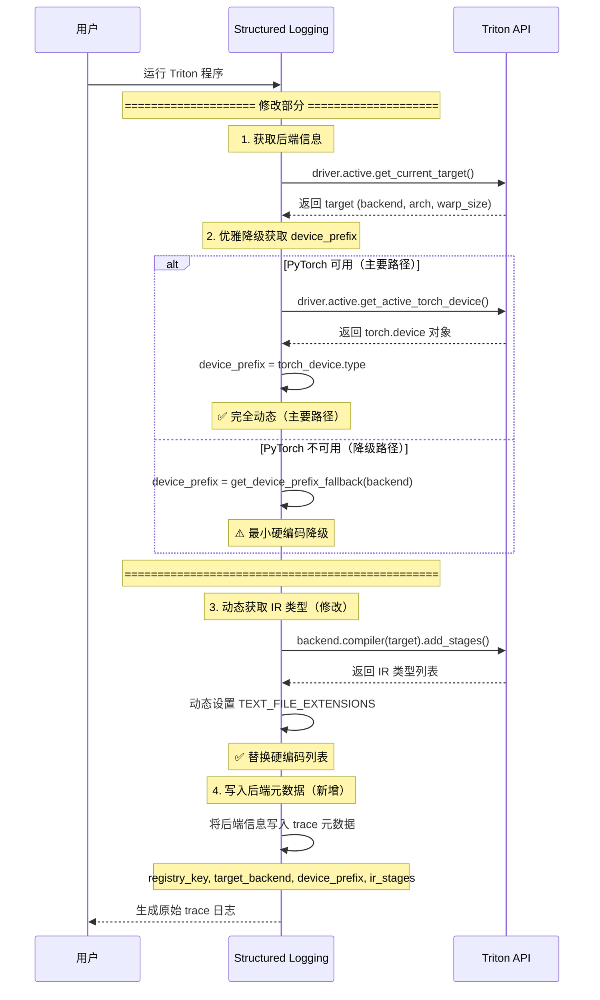
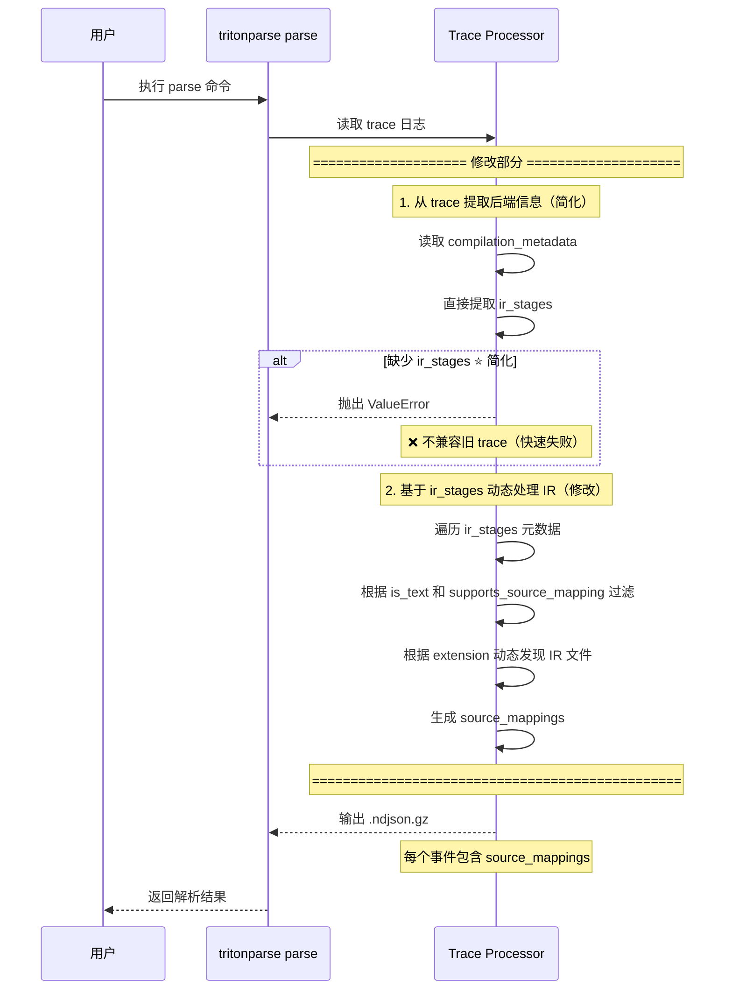
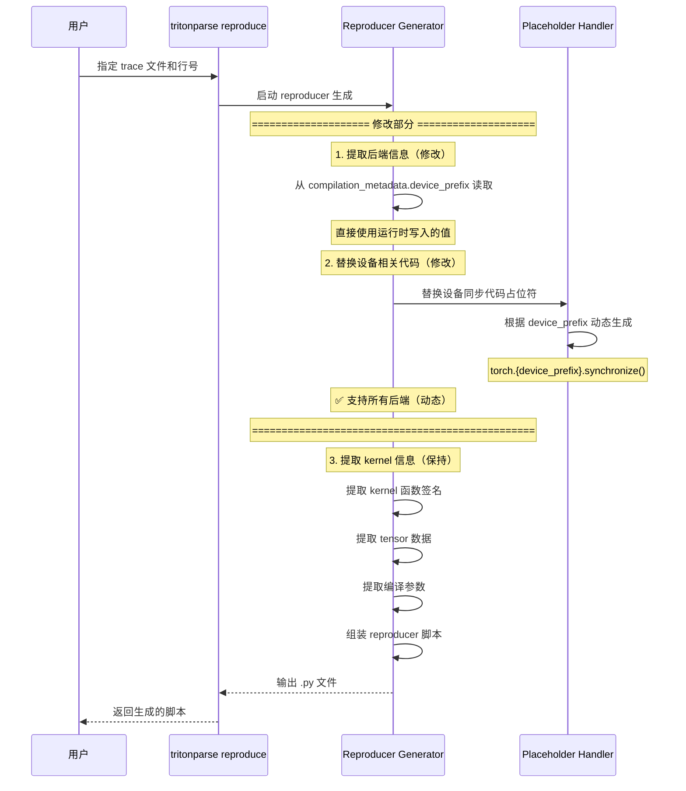

# RFC: TritonParse 后端无关架构

**作者**: @zhudada0120
**状态**: 已实现

## 摘要

本 RFC 提出为 TritonParse 构建后端无关架构，显著减少硬编码假设，使其能够支持 NVIDIA、AMD、Ascend 及未来新增的 Triton 后端，**IR 处理流程无需代码修改**。

核心设计理念是**元数据驱动**：
1. **运行时**：通过 Triton API 动态发现后端能力，写入 `ir_stages` 元数据
2. **解析阶段**：基于 `ir_stages` 元数据动态发现和处理任意后端的 IR 类型
3. **Reproducer**：从 trace 元数据读取设备信息，动态生成设备特定代码
4. **前端**：基于元数据动态生成 UI，自动适配不同后端

## 背景

### 初始状态的问题

TritonParse 在实现此 RFC 之前存在大量硬编码假设：

```python
# ❌ 硬编码的 IR 类型列表
TEXT_FILE_EXTENSIONS = [".ttir", ".ttgir", ".llir", ".ptx", ".amdgcn", ".json"]

# ❌ 硬编码的 IR 类型判断
ttir_key = next((k for k in file_content if k.endswith(".ttir")), None)
ttgir_key = next((k for k in file_content if k.endswith(".ttgir")), None)
ptx_key = next((k for k in file_content if k.endswith(".ptx")), None)
# ... 每次支持新后端都要添加硬编码

# ❌ 硬编码的解析器选择
if stage_name in ["ptx", "amdgcn"]:
    parser = AssemblyParser()
elif stage_name.endswith("ir") or stage_name.startswith("tt"):
    parser = GenericParser()
```

### 多后端需求

不同 Triton 后端使用完全不同的 IR 类型和设备 API：
- **NVIDIA**: `ttir`, `ttgir`, `ptx` → `torch.cuda`
- **AMD**: `ttir`, `ttgir`, `amdgcn` → `torch.cuda` (PyTorch 兼容)
- **Ascend**: `ttir`, `ttadapter`, `bcmlir` → `torch.npu`

每次支持新后端都需要修改多处代码，维护成本高，且不支持未来未知后端。

## 目标状态

### 最终状态

- ✅ **消除大部分硬编码 IR 类型**：支持任意后端的任意 IR 类型，IR 处理流程无需代码修改
- ⚠️ **解析器选择仍有硬编码**：运行时推断规则和解析器选择逻辑仍存在硬编码（见"已知限制"）
- ✅ **动态发现**：通过 Triton API 自动发现后端能力
- ✅ **元数据驱动**：IR 处理流程基于 `ir_stages` 元数据
- ✅ **显著提升通用性**：新后端只需实现 Triton 接口即可自动支持 IR 处理

## 整体架构

### 数据流



## 核心设计

### 1. 三层后端标识符

为了在不同场景下准确标识后端，定义三层标识符：

```python
# 三层后端标识符
{
    "registry_key": "nvidia",        # Triton 后端注册表键
    "target_backend": "cuda",         # 编译目标后端名
    "device_prefix": "cuda",          # PyTorch 设备命名空间
}
```

| 标识符 | 来源 | 作用域 | 示例 |
|--------|------|--------|------|
| `registry_key` | `triton.backends.backends` 键 | 访问 Triton 后端对象 | `"nvidia"`, `"amd"`, `"ascend"` |
| `target_backend` | `target.backend` | Triton 编译目标 | `"cuda"`, `"hip"`, `"npu"` |
| `device_prefix` | PyTorch 设备类型 | 前端 API、reproducer | `"cuda"`, `"cuda"`, `"npu"` |

**映射关系**（`tritonparse/backends.py`）：
```python
def get_registry_key(target_backend: str) -> str:
    """将编译目标映射到注册表键"""
    mapping = {
        "cuda": "nvidia",
        "hip": "amd",
        "npu": "ascend",
    }
    return mapping.get(target_backend, target_backend)

def get_device_prefix_fallback(backend: str) -> str:
    """降级策略：后端名到设备前缀（仅 PyTorch 不可用时）"""
    mapping = {
        "cuda": "cuda",
        "hip": "cuda",    # AMD ROCm 使用 cuda 命名空间
        "npu": "npu",
    }
    return mapping.get(backend, backend)
```

### 2. IR 阶段四类能力

每个 IR 阶段通过四类能力元数据描述其特性：

```python
stage_info = {
    "name": "ttir",                          # IR 阶段名称
    "extension": ".ttir",                     # 文件扩展名
    "stage_origin": "backend",                   # 来源类型
    "is_text": true,                            # 是否文本格式
    "supports_source_mapping": true,            # 是否支持源码映射
    "mapping_kind": "generic",                   # 映射解析器类型
}
```

| 能力 | 类型 | 说明 | 示例 |
|------|------|------|------|
| `is_text` | `bool` | 是否为文本文件 | `ttir: true`, `mlirbc: false` |
| `supports_source_mapping` | `bool` | 是否支持从源码映射到 IR | `ttir: true`, `mlirbc: false` |
| `mapping_kind` | `string` | 源码映射解析器类型 | `"generic"`, `"ptx"`, `"sass"`, `"none"` |

**解析器类型**：
- `"generic"`：通用解析器（TTIR、TTGIR、TTAdapter、BCMLIR 等 Triton IR）
- `"ptx"`：PTX 专用解析器（处理 `// <line:123>` 注释）
- `"sass"`：SASS 专用解析器
- `"none"`：不支持源码映射（二进制文件）

### 3. 动态 IR 发现逻辑

**二进制文件判断**（内联规则）：
```python
binary_stages = ["npubin", "mlirbc", "cubin", "sass"]
is_text = stage_name.lower() not in binary_stages
```

**映射类型判断**（内联规则）：
```python
if stage_name.lower() in binary_stages:
    mapping_kind = "none"
elif stage_name in ["ptx", "amdgcn"]:
    mapping_kind = "ptx"
elif stage_name.endswith("ir") or stage_name.endswith("IR") or stage_name.startswith("tt"):
    mapping_kind = "generic"
else:
    mapping_kind = "none"
```

**源码映射支持**：
```python
supports_source_mapping = mapping_kind != "none"
```

### 4. 元数据结构

#### 4.1 compilation_metadata

**写入时机**：运行时 `init_backend_metadata()` 函数

**数据结构**：
```json
{
  "registry_key": "ascend",
  "target_backend": "npu",
  "device_prefix": "npu",
  "target": {
    "backend": "npu",
    "arch": "Ascend910B4",
    "warp_size": 0
  },
  "ir_stages": [
    {
      "name": "ttir",
      "extension": ".ttir",
      "stage_origin": "backend",
      "is_text": true,
      "supports_source_mapping": true,
      "mapping_kind": "generic"
    },
    {
      "name": "ttadapter",
      "extension": ".ttadapter",
      "stage_origin": "backend",
      "is_text": true,
      "supports_source_mapping": true,
      "mapping_kind": "generic"
    },
    {
      "name": "bcmlir",
      "extension": ".bcmlir",
      "stage_origin": "backend",
      "is_text": true,
      "supports_source_mapping": true,
      "mapping_kind": "generic"
    },
    {
      "name": "npubin",
      "extension": ".npubin",
      "stage_origin": "backend",
      "is_text": false,
      "supports_source_mapping": false,
      "mapping_kind": "none"
    }
  ]
}
```

## 实现方案

### 1. 运行时：动态发现后端能力

**实现位置**：`tritonparse/structured_logging.py`

**核心函数**：`init_backend_metadata()`



```python
def init_backend_metadata():
    """
    初始化后端元数据和 IR 阶段信息。

    这是唯一调用 driver.active 和 add_stages() 的地方。
    更新 _BACKEND_METADATA, _IR_STAGES, TEXT_FILE_EXTENSIONS 全局变量。
    """
    global _BACKEND_METADATA, _IR_STAGES, TEXT_FILE_EXTENSIONS

    try:
        from triton.runtime import driver
        from triton.backends import backends
        from triton.backends.compiler import Language

        # 获取当前活跃后端
        active_driver = driver.active
        target = active_driver.get_current_target()

        # 动态检测 device_prefix（PyTorch 命名空间）
        try:
            import torch
            import triton.backends.ascend.driver as ascend_driver
            if not hasattr(ascend_driver, 'torch'):
                ascend_driver.torch = torch
            torch_device = active_driver.get_active_torch_device()
            device_prefix = torch_device.type
        except (ImportError, AttributeError, NameError):
            device_prefix = get_device_prefix_fallback(target.backend)

        # 获取后端注册表键
        registry_key = get_registry_key(target.backend)

        # 调用 add_stages() 动态发现 IR 阶段
        backend_obj = backends[registry_key]
        compiler = backend_obj.compiler(target)
        options = compiler.parse_options({})

        stages = {}
        compiler.add_stages(stages, options, Language.TRITON)

        # 构建 IR 阶段元数据
        ir_stages = []
        for stage_name in stages.keys():
            # 内联规则：is_text（二进制 vs 文本）
            binary_stages = ["npubin", "mlirbc", "cubin", "sass"]
            is_text = stage_name.lower() not in binary_stages

            # 内联规则：mapping_kind
            if stage_name.lower() in binary_stages:
                mapping_kind = "none"
            elif stage_name in ["ptx", "amdgcn"]:
                mapping_kind = "ptx"
            elif stage_name.endswith("ir") or stage_name.endswith("IR") or stage_name.startswith("tt"):
                mapping_kind = "generic"
            else:
                mapping_kind = "none"

            # 内联规则：supports_source_mapping
            supports_source_mapping = mapping_kind != "none"

            stage_info = {
                "name": stage_name,
                "extension": f".{stage_name}",
                "stage_origin": "backend",
                "is_text": is_text,
                "supports_source_mapping": supports_source_mapping,
                "mapping_kind": mapping_kind,
            }
            ir_stages.append(stage_info)

        # 动态更新 TEXT_FILE_EXTENSIONS
        TEXT_FILE_EXTENSIONS[:] = [
            stage_info["extension"]
            for stage_info in ir_stages
            if stage_info["is_text"]
        ]
        TEXT_FILE_EXTENSIONS.append(".json")

        # 存储后端元数据
        _BACKEND_METADATA = {
            "registry_key": registry_key,
            "target_backend": target.backend,
            "device_prefix": device_prefix,
            "target": {
                "backend": target.backend,
                "arch": target.arch,
                "warp_size": target.warp_size,
            },
        }

        _IR_STAGES = ir_stages

    except Exception as e:
        log.error(f"Failed to initialize backend metadata: {e}")
        _BACKEND_METADATA = None
        _IR_STAGES = None
```

**写入位置**：`trace_structured_triton()` 函数

```python
def trace_structured_triton(...):
    # 添加后端元数据到 trace_data
    if _BACKEND_METADATA is not None:
        trace_data["compilation_metadata"] = _BACKEND_METADATA.copy()
        if _IR_STAGES is not None:
            trace_data["compilation_metadata"]["ir_stages"] = _IR_STAGES
```

### 2. 解析阶段：动态 IR 发现和处理

**实现位置**：`tritonparse/parse/trace_processor.py`

**核心函数**：`parse_single_trace_content()`



```python
def parse_single_trace_content(trace_content: str) -> str:
    """
    处理单个 trace 内容，提取源码映射。

    基于 ir_stages 元数据动态发现 IR 类型，支持任意后端。
    """
    entry = json.loads(trace_content)
    if entry.get("event_type") == "compilation":
        payload = entry.setdefault("payload", {})
        file_content = payload.get("file_content", {})
        file_path = payload.get("file_path", {})

        # 获取 ir_stages 元数据
        if "compilation_metadata" in entry:
            ir_stages = entry["compilation_metadata"].get("ir_stages", [])
        elif "compilation_metadata" in payload:
            ir_stages = payload["compilation_metadata"].get("ir_stages", [])
        else:
            ir_stages = []

        if not ir_stages:
            raise ValueError(
                "Trace file is missing ir_stages metadata. "
                "Please regenerate the trace using a version of tritonparse that supports "
                "the RFC backend-agnostic design."
            )

        # 基于 ir_stages 元数据动态发现 IR 文件
        ir_keys_and_maps = []
        for stage in ir_stages:
            stage_name = stage["name"]
            extension = stage["extension"]
            is_text = stage["is_text"]
            supports_source_mapping = stage["supports_source_mapping"]

            # 跳过二进制文件或不支持源码映射的文件
            if not is_text or not supports_source_mapping:
                continue

            # 根据扩展名查找 IR 文件
            ir_key = next((k for k in file_content if k.endswith(extension)), None)
            if not ir_key:
                continue

            ir_keys_and_maps.append((stage_name, ir_key))

        # 动态处理所有 IR 文件
        ir_maps = {}
        for stage_name, ir_key in ir_keys_and_maps:
            # 第一个 IR 无依赖，后续 IR 依赖所有前面的 IR
            dependencies = [ir_maps[name] for name, _ in ir_keys_and_maps if name in ir_maps and ir_maps[name]]
            ir_map = process_ir(ir_key, file_content, file_path, dependencies)
            ir_maps[stage_name] = ir_map

        # 在所有 IR 之间创建双向映射
        ir_types = list(ir_maps.keys())
        for i, src_type in enumerate(ir_types):
            for tgt_type in ir_types[i + 1:]:
                if ir_maps[src_type] and ir_maps[tgt_type]:
                    create_bidirectional_mapping(
                        ir_maps[src_type], ir_maps[tgt_type], src_type, tgt_type
                    )

        # 创建 Python 源码映射
        if "python_source" in payload:
            ir_mappings = [
                (get_file_extension(ir_key), ir_maps[stage_name])
                for stage_name, ir_key in ir_keys_and_maps
                if ir_key and ir_maps.get(stage_name)
            ]
            py_map = create_python_mapping(ir_mappings)

        # 动态构建 source_mappings 字典
        payload["source_mappings"] = {
            stage_name: ir_maps[stage_name]
            for stage_name in ir_types
            if ir_maps[stage_name] is not None
        }
        payload["source_mappings"]["python"] = py_map

    return json.dumps(entry, separators=(",", ":")) + "\n"
```

**关键改进**：
- ✅ **删除了 IR 处理流程中的硬编码 IR 类型列表**（`.ttir`, `.ttgir`, `.ptx` 等）
- ✅ **完全基于 `ir_stages` 元数据**动态发现和处理 IR
- ✅ **解析器选择使用 `mapping_kind` 元数据**（已消除硬编码）
- ✅ **自动支持任意后端的任意 IR 类型**
- ✅ **智能过滤**：自动跳过二进制文件和不支持源码映射的 IR

### 3. Reproducer：设备无关代码生成

**实现位置**：`tritonparse/reproducer/placeholder_replacer.py`

**核心逻辑**：从 trace 读取 `device_prefix`



```python
def _infer_execution_device(context_bundle: ContextBundle) -> str:
    """从 compilation_metadata.device_prefix 读取设备类型（RFC 设计）。"""
    raw_launch_event = context_bundle.raw_launch_event

    compilation_metadata = raw_launch_event.get("compilation_metadata", {})
    device_prefix = compilation_metadata.get("device_prefix")

    if device_prefix:
        return device_prefix

    raise ValueError(
        "Trace file is missing device_prefix in compilation_metadata. "
        "Please regenerate the trace using a version of tritonparse that supports "
        "the RFC backend-agnostic design."
    )

def _build_synchronize_snippet(context_bundle: ContextBundle) -> str:
    """构建后端特定的同步调用"""
    device_prefix = _infer_execution_device(context_bundle)
    return f"torch.{device_prefix}.synchronize()"
```

**生成代码示例**：
- NVIDIA: `torch.cuda.synchronize()`
- Ascend: `torch.npu.synchronize()`
- 未来: `torch.{device_prefix}.synchronize()`

### 4. 前端：完全元数据驱动

#### 4.1 动态 IR 类型提取

**实现位置**：`website/src/utils/dynamicIRExtraction.ts`

```typescript
/**
 * 动态生成 IR 类型检查列表（基于 ir_stages 元数据）
 */
export function generateIRTypesToCheck(
    kernel: ProcessedKernel
): Array<{ type: string; property: string }> {
    if (!kernel.metadata?.ir_stages) {
        // 降级：从文件名提取
        return extractAllIRTypes(kernel).map(irType => ({
            type: irType,
            property: getMappingProperty(irType)
        }));
    }

    // 基于 ir_stages 元数据
    return kernel.metadata.ir_stages
        .filter(stage => stage.is_text && stage.supports_source_mapping)
        .map(stage => ({
            type: stage.name,
            property: getMappingProperty(stage.name)
        }));
}
```

#### 4.2 动态语法高亮

**实现位置**：`website/src/utils/syntaxHighlight.ts`

```typescript
/**
 * 基于 mapping_kind 元数据选择高亮器
 */
export function selectHighlighterByMappingKind(
    kernel: ProcessedKernel,
    irType: string
): string {
    if (!kernel.metadata?.ir_stages) {
        return inferSyntaxHighlighter(irType);  // 降级
    }

    const stageInfo = kernel.metadata.ir_stages.find(
        stage => stage.name === irType
    );

    if (!stageInfo) {
        return inferSyntaxHighlighter(irType);  // 降级
    }

    // 基于 mapping_kind 元数据选择高亮器
    switch (stageInfo.mapping_kind) {
        case 'generic':
            return 'mlir';     // TTIR, TTGIR, TTAdapter, BCMLIR
        case 'ptx':
            return 'asm';       // PTX, AMDGCN
        case 'sass':
            return 'asm';       // SASS
        default:
            return 'text';
    }
}
```

#### 4.3 IR 阶段信息类型定义

**实现位置**：`website/src/utils/dataLoader.ts`

```typescript
/**
 * IR 阶段能力元数据
 */
export interface IRStageInfo {
    /** IR 阶段名称（例如 "ptx", "ttir"） */
    name: string;
    /** 文件扩展名（例如 ".ptx"） */
    extension: string;
    /** 后端原生或派生阶段 */
    stage_origin: "backend" | "derived";
    /** 是否为文本输出 */
    is_text: boolean;
    /** 是否支持源码映射 */
    supports_source_mapping: boolean;
    /** 源码映射解析器类型 */
    mapping_kind: "generic" | "ptx" | "sass" | "none";
}
```

## 关键文件修改

| 文件 | 修改内容 | 状态 |
|------|----------|------|
| `tritonparse/structured_logging.py` | 添加 `init_backend_metadata()` 函数，动态发现后端能力，写入 `ir_stages` 元数据 | ✅ 已实现 |
| `tritonparse/parse/trace_processor.py` | `parse_single_trace_content()` 基于 `ir_stages` 动态发现 IR | ✅ 已实现 |
| `tritonparse/reproducer/placeholder_replacer.py` | 从 trace 元数据读取 `device_prefix`，动态生成代码 | ✅ 已实现 |
| `tritonparse/backends.py` | 后端信息提取工具（`extract_backend_from_trace()`, `get_registry_key()`, `get_device_prefix_fallback()`） | ✅ 已实现 |
| `website/src/utils/dynamicIRExtraction.ts` | 动态 IR 类型提取（`generateIRTypesToCheck()`） | ✅ 已实现 |
| `website/src/utils/syntaxHighlight.ts` | 基于 `mapping_kind` 动态选择语法高亮器 | ✅ 已实现 |
| `website/src/utils/dataLoader.ts` | `IRStageInfo` 接口定义（6个核心字段） | ✅ 已实现 |

## 关键改进

### 1. 显著减少硬编码

**已删除的硬编码**：
- ❌ `TEXT_FILE_EXTENSIONS = [".ttir", ...]` → ✅ 动态生成
- ❌ `ttir_key = next((k for k in file_content if k.endswith(".ttir")), None)` → ✅ 基于 `ir_stages` 发现
- ❌ IR 处理流程中的硬编码 IR 类型判断 → ✅ 动态发现和处理

**仍存在的硬编码**（见"已知限制"小节）：
- ⚠️ 运行时 `mapping_kind` 推断规则（`structured_logging.py`）
- ⚠️ 解析器选择逻辑（`trace_processor.py`）

### 2. 三层后端标识符

- **registry_key**：用于访问 Triton 后端注册表
- **target_backend**：Triton 编译目标
- **device_prefix**：PyTorch 设备命名空间

### 3. 四类 IR 阶段能力

- **is_text**：是否文本文件
- **supports_source_mapping**：是否支持源码映射
- **mapping_kind**：映射解析器类型
- **stage_origin**：来源类型（backend/derived）

### 4. 显著提升通用性

**新后端支持流程**：
1. 实现 Triton 后端接口（包括 `add_stages()` API）
2. 在 `add_stages()` 中声明所有 IR 阶段
3. 运行时自动发现并记录元数据
4. 解析阶段自动适配 IR 处理流程
5. ⚠️ **解析器选择仍需更新推断规则**（见"已知限制"）


## 已知限制和未来工作

### 暂未解决的硬编码：运行时 `mapping_kind` 推断

虽然本 RFC 实现了大部分后端无关化目标，但**仍有少量硬编码**存在于运行时元数据生成阶段。

#### 硬编码链条变化


```
[Triton API 不提供 mapping_kind]
           ↓
[运行时] 硬编码推断 mapping_kind 规则
           ↓
[解析时] ✅ 使用 mapping_kind 选择解析器
           ↓
[结果] 解析器选择已元数据驱动（但映射_kind 本身仍是推断的）
```

#### 硬编码 1：运行时推断 `mapping_kind` 的规则 ⚠️ 唯一剩余的硬编码

**位置**：`tritonparse/structured_logging.py` 第 1755-1763 行

```python
# Inline rule: mapping_kind
if stage_name.lower() in binary_stages:
    mapping_kind = "none"
elif stage_name in ["ptx", "amdgcn"]:
    mapping_kind = "ptx"
elif stage_name.endswith("ir") or stage_name.endswith("IR") or stage_name.startswith("tt"):
    mapping_kind = "generic"
else:
    mapping_kind = "none"
```

**硬编码内容**：
- 二进制 stage 列表：`binary_stages = ["npubin", "mlirbc", "cubin", "sass"]`
- PTX 类型判断：`stage_name in ["ptx", "amdgcn"]`
- IR 类型判断：`stage_name.endswith("ir") or stage_name.startswith("tt")`

**根本原因**：
Triton 的 `add_stages()` API 只返回 stage 名称和编译函数，**不包含** `mapping_kind`、`is_text`、`supports_source_mapping` 等 tritonparse 需要的元数据。

#### ✅ 已解决：解析器选择现在使用 `mapping_kind`

**修复位置**：`tritonparse/parse/trace_processor.py`

**修复内容**：

1. **`parse_single_trace_content` 现在提取 `mapping_kind`**：
```python
for stage in ir_stages:
    stage_name = stage["name"]
    extension = stage["extension"]
    is_text = stage["is_text"]
    supports_source_mapping = stage["supports_source_mapping"]
    mapping_kind = stage["mapping_kind"]  # ✅ 提取 mapping_kind
    ir_keys_and_maps.append((stage_name, ir_key, mapping_kind))
```


#### 硬编码位置对比表

| 阶段 | 位置 | 硬编码内容 | RFC 预期 | 实际状态 |
|------|------|-----------|----------|----------|
| **运行时** | `structured_logging.py` | `binary_stages`, `mapping_kind` 推断规则 | 后端提供元数据 | ❌ 内联规则 |
| **解析** | `trace_processor.py` | ✅ 无硬编码（使用 `mapping_kind`） | 基于 `mapping_kind` | ✅ 已实现 |
| **前端** | `syntaxHighlight.ts` | - | 基于 `mapping_kind` | ✅ 已实现 |

#### 当前状态

- ✅ **解析阶段已完全元数据驱动**：基于 `mapping_kind` 选择解析器
- ⚠️ **运行时仍有硬编码**：`mapping_kind` 本身是通过规则推断的，不是后端提供的
- ✅ **前后端一致**：都基于 `mapping_kind` 元数据

#### 影响

现在只需修改**一个地方**：
- `structured_logging.py` 的 `mapping_kind` 推断规则

解析器选择会自动适配，无需同步修改。

### 未来完全元数据驱动的方案

要彻底消除硬编码，需要让**Triton 后端本身提供完整的 IR stage 元数据**：

#### 理想状态：后端提供元数据

```python
# 在 triton-ascend/backend/compiler.py 中
class AscendCompiler(BaseBackend):
    def get_ir_stages_metadata(self):
        """后端主动声明每个 IR stage 的完整元数据"""
        return [
            {
                "name": "ttir",
                "extension": ".ttir",
                "is_text": True,
                "supports_source_mapping": True,
                "mapping_kind": "generic",  # ✅ 后端提供
            },
            {
                "name": "ttadapter",
                "extension": ".ttadapter",
                "is_text": True,
                "supports_source_mapping": True,
                "mapping_kind": "generic",
            },
            {
                "name": "npubin",
                "extension": ".npubin",
                "is_text": False,
                "supports_source_mapping": False,
                "mapping_kind": "none",
            },
        ]
```

#### TritonParse 负责读取和执行

```python
# tritonparse/structured_logging.py
# 不再需要内联规则，直接从后端 API 读取
ir_stages = backend_obj.compiler.get_ir_stages_metadata()

# tritonparse/parse/trace_processor.py
# 完全基于 mapping_kind 元数据选择解析器
for stage in ir_stages:
    mapping_kind = stage["mapping_kind"]
    if mapping_kind == "ptx":
        parser = PTParser()
    elif mapping_kind == "generic":
        parser = GenericLocParser()
    elif mapping_kind == "sass":
        parser = SASSParser()
```

### 实现路径建议

1. **短期**（当前 RFC）：
   - ✅ 集中硬编码到 `structured_logging.py`
   - ✅ 解析器选择使用 `mapping_kind` 元数据
   - ✅ 前端完全元数据驱动

2. **中期**（✅ 已完成）：
   - ✅ 修改 `trace_processor.py` 使用 `mapping_kind` 元数据
   - ✅ 消除解析器选择的硬编码

3. **长期**（根本解决）：
   - 在 Triton 后端接口中添加 `get_ir_stages_metadata()` API
   - 后端负责提供完整元数据
   - TritonParse 完全变成"读取和执行"逻辑

### 通用解决方案对比

| 方案 | 硬编码位置 | 扩展性 | 实现难度 | Triton 改动 |
|------|-----------|--------|---------|------------|
| **后端提供元数据** | Triton 后端 | ⭐⭐⭐⭐⭐ | 🔴 高 | 🔴 需要修改接口 |
| **配置文件驱动** | JSON/YAML | ⭐⭐⭐⭐ | 🟡 中 | 🟢 无 |
| **解析器注册表** | Python 导入时 | ⭐⭐⭐ | 🟢 低 | 🟢 无 |
| **当前方案** | 代码内联规则 | ⭐ | 🔴 硬编码无处不在 | 🟢 无 |

## 总结

通过引入**元数据驱动架构**，TritonParse 实现了大部分的后端无关性：

1. ✅ **运行时动态发现**：通过 Triton API 自动发现后端能力
2. ✅ **解析阶段通用**：基于 `ir_stages` 元数据动态处理 IR，解析器选择使用 `mapping_kind`
3. ✅ **前端自动适配**：动态生成 UI，支持任意 IR 类型组合
4. ⚠️ **少量硬编码残留**：运行时 `mapping_kind` 推断规则（已知限制）
5. ✅ **强制元数据要求**：不支持旧格式 trace，强制使用符合 RFC 的 trace 文件

这个架构为 Triton 生态的未来扩展奠定了坚实基础，显著减少了硬编码并提升了通用性。剩余的唯一硬编码在运行时 `mapping_kind` 推断（见"已知限制和未来工作"小节），这需要 Triton 后端接口的进一步支持。
