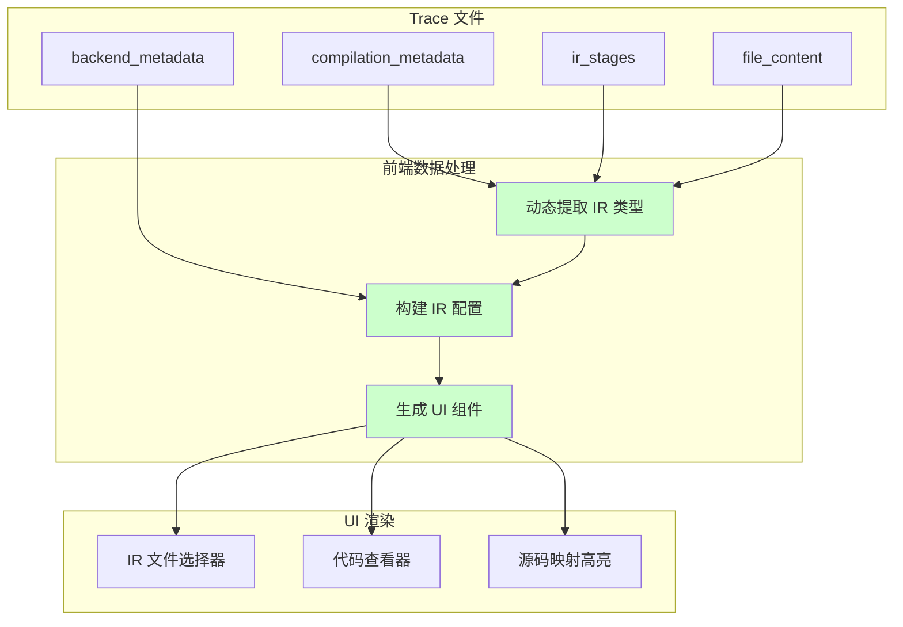

# RFC: TritonParse 前端多后端支持设计

**作者:** @zhudada0120
**相关 RFC:** [RFC-backend-agnostic-tritonparse.md](./RFC-backend-agnostic-tritonparse.md)
**状态:** 草案

## 摘要

本 RFC 补充前端的多后端支持设计，与后端通用化架构配合使用。核心理念是**完全元数据驱动的前端**，从 trace 数据中动态读取后端信息和 IR 类型，消除前端硬编码，实现真正的后端无关性。

关键改进：
- **动态 IR 类型发现**：从 `kernel.irFiles` 或 `compilation_metadata.ir_stages` 动态提取，替代硬编码列表
- **后端信息动态显示**：从 `backend_metadata` 读取设备类型、目标后端等信息
- **语法高亮自动适配**：根据 IR 类型动态选择语法高亮器
- **UI 组件通用化**：所有 UI 组件自动适应不同后端的 IR 类型和数量
- **向后兼容**：支持旧 trace 文件，渐进式升级

## 动机

当前前端存在以下问题：

### 1. 硬编码的 IR 类型列表

```typescript
// ❌ 当前实现：硬编码 IR 类型
const irTypesToCheck = [
    { type: "ttgir", property: "ttgir_lines" },
    { type: "ttir", property: "ttir_lines" },
    { type: "ptx", property: "ptx_lines" },
    { type: "llir", property: "llir_lines" },
    { type: "amdgcn", property: "amdgcn_lines" },
    { type: "sass", property: "sass_lines" }
];
```

**问题**：
- 添加新后端（如 Ascend 的 `ttadapter`、`bcmlir`）需要修改多处前端代码
- 无法支持未来可能的新后端
- 维护成本高，容易遗漏

### 2. 硬编码的语法高亮映射

```typescript
// ❌ 当前实现：硬编码语法高亮
if (irType.endsWith("ttgir") || irType.endsWith("ttir")) {
    return 'mlir';
} else if (irType.endsWith("llir")) {
    return 'llvm';
}
// 添加新 IR 类型需要修改这里
```

### 3. 硬编码的 IR 显示名称

```typescript
// ❌ 当前实现：硬编码显示名称
if (irType.endsWith("ttir")) {
    return "TTIR (Triton MLIR)";
} else if (irType.endsWith("ptx")) {
    return "PTX (Parallel Thread Execution)";
}
```

### 4. 固定的 UI 布局

当前前端假设 IR 类型的数量和顺序是固定的（TTIR → TTGIR → LLIR → PTX），无法适应不同后端的 IR 流程差异。

---

## 提议的实现

### 核心设计原则

1. **元数据驱动**：所有后端和 IR 信息从 trace 数据中读取
2. **零硬编码**：前端不包含任何后端特定的硬编码列表
3. **自动适配**：UI 自动适应不同后端的 IR 类型和数量
4. **向后兼容**：支持旧 trace 文件，提供降级方案

---

### 架构设计

#### 数据流概览



---

### 1. 动态 IR 类型提取

#### 方案 A：从文件名提取（立即可用）

**适用场景**：现有 trace 文件（无 `ir_stages` 元数据）

```typescript
// tritonparse/website/src/utils/dynamicIRExtraction.ts

/**
 * 从文件名中提取 IR 类型
 * 例如：add_kernel.ptx → ptx
 */
export function extractIRType(filename: string): string | null {
    if (!filename || !filename.includes('.')) {
        return null;
    }

    const parts = filename.split('.');
    const irType = parts[parts.length - 1];

    // 过滤掉非 IR 文件类型
    const nonIRTypes = ['json', 'py', 'cpp', 'h', 'cu', 'source'];
    if (nonIRTypes.includes(irType)) {
        return null;
    }

    return irType;
}

/**
 * 从 ProcessedKernel 中动态提取所有 IR 类型
 */
export function extractAllIRTypes(kernel: ProcessedKernel): string[] {
    const irTypes = new Set<string>();

    // 从 irFiles 中提取
    if (kernel.irFiles) {
        Object.keys(kernel.irFiles).forEach(filename => {
            const irType = extractIRType(filename);
            if (irType) {
                irTypes.add(irType);
            }
        });
    }

    // 从 filePaths 中补充提取
    if (kernel.filePaths) {
        Object.keys(kernel.filePaths).forEach(filename => {
            const irType = extractIRType(filename);
            if (irType) {
                irTypes.add(irType);
            }
        });
    }

    return Array.from(irTypes).sort();
}
```

#### 方案 B：从 ir_stages 元数据提取（RFC 推荐方案）

**适用场景**：新 trace 文件（包含 `ir_stages` 元数据）

```typescript
// 扩展 KernelMetadata 接口（与 RFC 后端设计对齐）
export interface IRStageInfo {
    name: string;              // 例如 "ptx", "ttir"
    artifact_key: string;      // 例如 "ptx", "sass"
    extension: string;         // 例如 ".ptx"
    stage_origin: "backend" | "derived";  // 后端原生 or 派生
    derived_from?: string;     // 如果是派生，标明来源
    is_text: boolean;          // 是否为文本格式
    supports_source_mapping: boolean;
    mapping_kind: "generic" | "ptx" | "sass" | "none";
    supports_bidirectional_mapping: boolean;
}

export interface KernelMetadata {
    hash?: string;
    name?: string;

    // ✅ 新增：IR 阶段能力信息（来自 RFC 后端设计）
    ir_stages?: IRStageInfo[];

    target?: {
        backend?: string;      // 例如 "cuda", "hip", "npu"
        arch?: number;
        warp_size?: number;
    };

    // ... 其他字段
}

/**
 * 从 ir_stages 元数据中提取 IR 类型
 * 优先级高于文件名提取（因为包含能力信息）
 */
export function extractIRTypesFromMetadata(kernel: ProcessedKernel): string[] {
    if (kernel.metadata?.ir_stages) {
        return kernel.metadata.ir_stages
            .filter(stage => stage.is_text)  // 只返回文本 IR
            .map(stage => stage.name)
            .sort();
    }

    // 降级方案：从文件名提取
    return extractAllIRTypes(kernel);
}
```

#### 统一提取函数（自动选择方案）

```typescript
/**
 * 智能提取 IR 类型（自动选择最佳方案）
 */
export function extractIRTypesSmart(kernel: ProcessedKernel): string[] {
    // 优先使用元数据方案（如果可用）
    if (kernel.metadata?.ir_stages && kernel.metadata.ir_stages.length > 0) {
        return extractIRTypesFromMetadata(kernel);
    }

    // 降级到文件名提取
    return extractAllIRTypes(kernel);
}

/**
 * 获取完整的 IR 阶段信息（包含能力）
 */
export function getIRStageInfo(
    kernel: ProcessedKernel,
    irType: string
): IRStageInfo | undefined {
    if (!kernel.metadata?.ir_stages) {
        return undefined;
    }

    return kernel.metadata.ir_stages.find(stage => stage.name === irType);
}
```

---

### 2. 动态语法高亮

#### 基于规则的自动推断

```typescript
// tritonparse/website/src/utils/syntaxHighlight.ts

/**
 * 根据 IR 类型自动推断语法高亮器
 * 不再硬编码每个 IR 类型
 */
export function inferSyntaxHighlighter(irType: string): string {
    const lowerType = irType.toLowerCase();

    // MLIR 方言（TTIR, TTGIR, TTAdapter, BCMLIR 等）
    if (lowerType.includes('tt') || lowerType.includes('mlir')) {
        return 'mlir';
    }

    // LLVM IR（LLIR 及其变体）
    if (lowerType.includes('ll') || lowerType === 'llvm') {
        return 'llvm';
    }

    // 汇编格式（PTX, AMDGCN, SASS 等）
    if (['ptx', 'amdgcn', 'sass', 'asm'].some(type => lowerType.includes(type))) {
        return 'asm';
    }

    // JSON 格式
    if (lowerType === 'json') {
        return 'json';
    }

    // 默认降级到文本
    return 'text';
}

/**
 * 扩展的映射函数（向后兼容旧代码）
 */
export const mapLanguageToHighlighter = (language: string): string => {
    const lowerCaseLanguage = language.toLowerCase();

    // 优先使用显式映射（如果有的话）
    const explicitMapping: Record<string, string> = {
        'python': 'python',
        'cuda': 'cpp',
    };

    if (explicitMapping[lowerCaseLanguage]) {
        return explicitMapping[lowerCaseLanguage];
    }

    // 使用自动推断
    return inferSyntaxHighlighter(lowerCaseLanguage);
};
```

#### 基于元数据的高亮选择（高级方案）

```typescript
/**
 * 基于 mapping_kind 元数据选择高亮器
 * 这是最准确的方案，因为后端已经知道 IR 的性质
 */
export function selectHighlighterByMappingKind(
    kernel: ProcessedKernel,
    irType: string
): string {
    const stageInfo = getIRStageInfo(kernel, irType);

    if (!stageInfo) {
        // 降级到自动推断
        return inferSyntaxHighlighter(irType);
    }

    // 根据 mapping_kind 选择高亮器
    switch (stageInfo.mapping_kind) {
        case 'generic':
            // TTIR, TTGIR, TTAdapter, BCMLIR 等 MLIR 方言
            return 'mlir';

        case 'ptx':
            // PTX, AMDGCN 等汇编格式
            return 'asm';

        case 'sass':
            // SASS 等反汇编格式
            return 'asm';

        case 'none':
            // 不支持 source mapping 的 IR
            return 'text';

        default:
            return 'text';
    }
}
```

---

### 3. 动态 IR 显示名称

#### 基于规则的自动生成

```typescript
// tritonparse/website/src/utils/irDisplay.ts

/**
 * 自动生成 IR 类型的友好显示名称
 */
export function generateIRDisplayName(irType: string): string {
    const upperType = irType.toUpperCase();

    // 已知的 IR 类型缩写
    const knownAcronyms: Record<string, string> = {
        'TTIR': 'TTIR (Triton MLIR)',
        'TTGIR': 'TTGIR (TritonGPU MLIR)',
        'LLIR': 'LLIR (LLVM IR)',
        'PTX': 'PTX (Parallel Thread Execution)',
        'AMDGCN': 'AMDGCN (AMD GPU Code)',
        'SASS': 'SASS (NVIDIA Assembly)',
        'CUBIN': 'CUBIN (NVIDIA Binary)',
        'HSACO': 'HSACO (AMD ROCm Binary)',
    };

    if (knownAcronyms[upperType]) {
        return knownAcronyms[upperType];
    }

    // 对于未知 IR 类型，生成合理的显示名称
    // 例如：ttadapter → TTAdapter IR
    return `${upperType} IR`;
}
```

#### 基于元数据的显示名称（高级方案）

```typescript
/**
 * 扩展 IRStageInfo 接口，包含显示名称
 */
export interface IRStageInfo {
    name: string;
    display_name?: string;  // 可选的友好显示名称
    // ... 其他字段
}

/**
 * 获取 IR 显示名称（优先使用元数据）
 */
export function getIRDisplayName(
    kernel: ProcessedKernel,
    irType: string
): string {
    const stageInfo = getIRStageInfo(kernel, irType);

    if (stageInfo?.display_name) {
        return stageInfo.display_name;
    }

    // 降级到自动生成
    return generateIRDisplayName(irType);
}
```

---

### 4. 动态 IR 类型检查列表

#### 替代硬编码的 irTypesToCheck

```typescript
/**
 * 动态生成 IR 类型检查列表
 * 用于 CodeComparisonView 中的 source mapping 查找
 */
export function generateIRTypesToCheck(
    kernel: ProcessedKernel
): Array<{ type: string; property: string }> {
    const irTypes = extractIRTypesSmart(kernel);

    return irTypes.map(irType => ({
        type: irType,
        property: `${irType}_lines`  // 例如：ptx → ptx_lines
    }));
}

// ✅ 在 CodeComparisonView.tsx 中使用
const calculateIRLines = useCallback(
    (
        sourceMapping: Record<string, SourceMapping>,
        lineNumber: number,
        targetTitle: string,
        kernel: ProcessedKernel
    ): number[] => {
        const lineKey = lineNumber.toString();
        if (!sourceMappings[lineKey]) return [];

        const sourceMapping = sourceMappings[lineKey];
        const targetIRType = getIRType(targetTitle);

        // ✅ 动态生成（替代硬编码）
        const irTypesToCheck = generateIRTypesToCheck(kernel);

        for (const { type, property } of irTypesToCheck) {
            if (targetIRType === type &&
                sourceMapping[property as keyof SourceMapping] !== undefined) {
                const lines = sourceMapping[property as keyof SourceMapping] as number[];
                return lines.map(line =>
                    typeof line === 'string' ? parseInt(line, 10) : line
                );
            }
        }

        return [];
    },
    []
);
```

---

### 5. UI 组件多后端适配

#### IR 文件选择器动态生成

```typescript
/**
 * 动态生成 IR 文件选择选项
 * 自动适应不同后端的 IR 类型
 */
export function generateIRFileOptions(
    kernel: ProcessedKernel
): Array<{ value: string; label: string; displayName: string }> {
    const irTypes = extractIRTypesSmart(kernel);

    return irTypes.map(irType => ({
        value: irType,
        label: irType,
        displayName: getIRDisplayName(kernel, irType)
    }));
}

// ✅ 在 IR 选择组件中使用
function IRFileSelector({ kernel, selectedIR, onIRChange }: Props) {
    const irOptions = useMemo(
        () => generateIRFileOptions(kernel),
        [kernel]
    );

    return (
        <select value={selectedIR} onChange={(e) => onIRChange(e.target.value)}>
            {irOptions.map(option => (
                <option key={option.value} value={option.value}>
                    {option.displayName}
                </option>
            ))}
        </select>
    );
}
```

#### 后端信息显示组件

```typescript
/**
 * 显示后端信息的组件
 * 动态适配不同后端
 */
function BackendInfo({ kernel }: { kernel: ProcessedKernel }) {
    const backendMetadata = kernel.backend_metadata;
    const targetMetadata = kernel.metadata?.target;

    if (!backendMetadata && !targetMetadata) {
        return null;
    }

    return (
        <div className="backend-info">
            <h3>Backend Information</h3>

            {/* 设备类型 */}
            {backendMetadata?.device_prefix && (
                <InfoRow
                    label="Device Type"
                    value={formatDeviceType(backendMetadata.device_prefix)}
                />
            )}

            {/* 目标后端 */}
            {backendMetadata?.target_backend && (
                <InfoRow
                    label="Target Backend"
                    value={formatTargetBackend(backendMetadata.target_backend)}
                />
            )}

            {/* 架构信息 */}
            {targetMetadata?.arch && (
                <InfoRow
                    label="Architecture"
                    value={`sm${targetMetadata.arch}`}
                />
            )}

            {/* Warp size */}
            {targetMetadata?.warp_size && (
                <InfoRow
                    label="Warp Size"
                    value={targetMetadata.warp_size.toString()}
                />
            )}
        </div>
    );
}

function formatDeviceType(devicePrefix: string): string {
    const typeMap: Record<string, string> = {
        'cuda': 'CUDA (NVIDIA)',
        'npu': 'NPU (Ascend)',
        'xpu': 'XPU (Intel)',
    };
    return typeMap[devicePrefix] || devicePrefix.toUpperCase();
}

function formatTargetBackend(backend: string): string {
    const backendMap: Record<string, string> = {
        'cuda': 'CUDA',
        'hip': 'HIP (AMD ROCm)',
        'npu': 'NPU (Ascend)',
    };
    return backendMap[backend] || backend.toUpperCase();
}
```

---

### 6. Source Mapping 动态处理

#### 扩展 SourceMapping 接口

```typescript
/**
 * 动态 SourceMapping 接口
 * 不再硬编码具体的 IR 类型
 */
export interface DynamicSourceMapping {
    // 动态字段：key 是 IR 类型，value 是行号数组
    [irType: string]: number[] | undefined;
}

/**
 * 动态提取 source mapping
 */
export function extractSourceMapping(
    kernel: ProcessedKernel,
    irType: string
): number[] | undefined {
    const mappings = kernel.sourceMappings;

    if (!mappings) {
        return undefined;
    }

    // 查找对应 IR 类型的 mapping
    // 例如：ptx → ptx_lines
    const property = `${irType}_lines`;

    // 遍历所有 source mapping 查找
    for (const mapping of Object.values(mappings)) {
        if (mapping[property as keyof SourceMapping]) {
            return mapping[property as keyof SourceMapping] as number[];
        }
    }

    return undefined;
}
```

---

### 7. 向后兼容策略

#### 渐进式升级路径

```typescript
/**
 * 兼容性检测和降级处理
 */
export class BackendAwareDataLoader {
    /**
     * 检测 trace 版本
     */
    static detectTraceVersion(kernel: ProcessedKernel): 'new' | 'old' {
        if (kernel.metadata?.ir_stages && kernel.metadata.ir_stages.length > 0) {
            return 'new';  // 新 trace：有 ir_stages 元数据
        }
        return 'old';    // 旧 trace：只有文件内容
    }

    /**
     * 统一的 IR 类型提取（自动适配新旧 trace）
     */
    static extractIRTypes(kernel: ProcessedKernel): string[] {
        const version = this.detectTraceVersion(kernel);

        switch (version) {
            case 'new':
                return extractIRTypesFromMetadata(kernel);

            case 'old':
                return extractAllIRTypes(kernel);

            default:
                return [];
        }
    }

    /**
     * 统一的语法高亮选择
     */
    static selectHighlighter(
        kernel: ProcessedKernel,
        irType: string
    ): string {
        const version = this.detectTraceVersion(kernel);

        if (version === 'new') {
            // 新 trace：基于 mapping_kind 选择
            return selectHighlighterByMappingKind(kernel, irType);
        } else {
            // 旧 trace：基于规则推断
            return inferSyntaxHighlighter(irType);
        }
    }
}
```

#### 降级方案总结

| 功能 | 新 trace（有 ir_stages） | 旧 trace（无 ir_stages） |
|------|-------------------------|------------------------|
| **IR 类型提取** | 从 `ir_stages` 读取 | 从文件名提取 |
| **语法高亮** | 基于 `mapping_kind` | 基于规则推断 |
| **显示名称** | 使用元数据 | 自动生成 |
| **Source Mapping** | 根据 `supports_source_mapping` | 尝试所有 IR 类型 |

---

## 实现计划

### Phase 1: 基础动态提取（立即实施）

**目标**：消除硬编码 IR 类型列表

**任务**：
1. ✅ 实现 `extractIRType()` 和 `extractAllIRTypes()`
2. ✅ 实现 `generateIRTypesToCheck()` 替代硬编码列表
3. ✅ 修改 [CodeComparisonView.tsx](website/src/components/CodeComparisonView.tsx:248-257)
4. ✅ 修改 [CodeViewer.tsx](website/src/components/CodeViewer.tsx:171-180) 的语法高亮
5. ✅ 修改 [irLanguage.ts](website/src/utils/irLanguage.ts:12-30) 的显示名称

**影响**：
- 支持任意后端的 IR 类型（包括未来新增的）
- 适用于现有 trace 文件
- 无需后端改动

### Phase 2: 元数据驱动（RFC 完整实现后）

**目标**：使用 `ir_stages` 元数据实现更精确的控制

**任务**：
1. ✅ 扩展 `KernelMetadata` 接口，添加 `ir_stages` 字段
2. ✅ 实现 `getIRStageInfo()` 读取阶段能力
3. ✅ 实现 `selectHighlighterByMappingKind()`
4. ✅ 根据 `supports_source_mapping` 动态显示/隐藏 IR 类型
5. ✅ 添加后端信息显示组件

**影响**：
- 完全元数据驱动
- 支持阶段能力过滤（只显示文本 IR）
- 更准确的语法高亮和显示名称

### Phase 3: UI 优化（增强用户体验）

**任务**：
1. ✅ 添加后端标识显示（NVIDIA/AMD/Ascend logo 或标签）
2. ✅ 动态调整 IR 文件选择顺序（根据 `ir_stages` 的顺序）
3. ✅ 显示派生 IR 的来源（例如 "SASS (from CUBIN)"）
4. ✅ 优化移动端适配（处理大量 IR 类型）

---

## 修改影响分析

### 需要修改的文件

| 文件 | 修改内容 | 优先级 |
|------|---------|--------|
| **新增** `website/src/utils/dynamicIRExtraction.ts` | 动态 IR 提取工具函数 | 🔴 P0 |
| **新增** `website/src/utils/syntaxHighlight.ts` | 动态语法高亮 | 🔴 P0 |
| **新增** `website/src/utils/irDisplay.ts` | 动态显示名称 | 🟡 P1 |
| [website/src/utils/dataLoader.ts](website/src/utils/dataLoader.ts:70-84) | 扩展 KernelMetadata 接口 | 🔴 P0 |
| [website/src/components/CodeComparisonView.tsx](website/src/components/CodeComparisonView.tsx:248-257) | 使用动态 IR 列表 | 🔴 P0 |
| [website/src/components/CodeViewer.tsx](website/src/components/CodeViewer.tsx:171-180) | 动态语法高亮 | 🔴 P0 |
| [website/src/utils/irLanguage.ts](website/src/utils/irLanguage.ts:12-30) | 动态显示名称 | 🟡 P1 |

### 向后兼容性

| Trace 版本 | IR 类型提取 | 语法高亮 | 显示名称 |
|-----------|------------|---------|---------|
| **旧 trace** | ✅ 从文件名提取 | ✅ 规则推断 | ✅ 自动生成 |
| **新 trace** | ✅ 从 ir_stages 读取 | ✅ 基于 mapping_kind | ✅ 元数据或生成 |

---

## 测试策略

### 单元测试

```typescript
// tests/unit/dynamicIRExtraction.test.ts

describe('extractIRType', () => {
    it('should extract IR type from filename', () => {
        expect(extractIRType('add_kernel.ptx')).toBe('ptx');
        expect(extractIRType('kernel.ttadapter')).toBe('ttadapter');
    });

    it('should filter non-IR files', () => {
        expect(extractIRType('source.json')).toBeNull();
        expect(extractIRType('config.py')).toBeNull();
    });
});

describe('extractAllIRTypes', () => {
    it('should extract unique IR types from kernel', () => {
        const kernel: ProcessedKernel = {
            irFiles: {
                'kernel.ptx': '...',
                'kernel.ttir': '...',
                'kernel.json': '{}'
            }
        };

        const types = extractAllIRTypes(kernel);
        expect(types).toEqual(['ptx', 'ttir']);
    });
});
```

### 集成测试

- 测试 NVIDIA 后端 trace（ptx, sass, cubin）
- 测试 AMD 后端 trace（amdgcn, hsaco）
- 测试 Ascend 后端 trace（ttadapter, bcmlir）
- 测试旧 trace 文件兼容性

---

## 缺点和权衡

### 1. 轻微性能开销

**问题**：动态提取 IR 类型需要遍历文件名

**影响**：
- 首次加载时增加 ~1-5ms
- 可通过 memoization 缓解

**缓解措施**：
```typescript
const cachedIRTypes = useMemo(
    () => extractAllIRTypes(kernel),
    [kernel]  // 只在 kernel 变化时重新计算
);
```

### 2. 未知 IR 类型的显示

**问题**：遇到完全未知的 IR 类型时，显示名称可能不够友好

**降级方案**：
```typescript
// 自动生成：xyz → XYZ IR
generateIRDisplayName('xyz')  // 返回 "XYZ IR"
```

### 3. 语法高亮可能不准确

**问题**：基于规则推断的高亮器可能不适用于某些特殊 IR

**降级方案**：
```typescript
// 默认降级到文本高亮
return 'text';
```

---

## 总结

本 RFC 提出的前端多后端支持方案，与后端通用化架构完全配合，实现了：

1. ✅ **零硬编码**：所有 IR 类型从 trace 中动态读取
2. ✅ **自动扩展**：支持任意后端，无需修改前端代码
3. ✅ **向后兼容**：支持旧 trace 文件，渐进式升级
4. ✅ **元数据驱动**：根据 `ir_stages` 实现精确控制
5. ✅ **用户体验**：自动适配不同后端的 UI 需求

**关键收益**：
- 添加新后端（如 Intel XPU）时，前端代码**完全不需要修改**
- 用户可以立即查看新后端的 IR 文件和 source mapping
- 降低维护成本，提高代码质量

这与 RFC 后端设计的核心理念完全一致：**从硬编码到元数据驱动，实现真正的后端无关性**。
