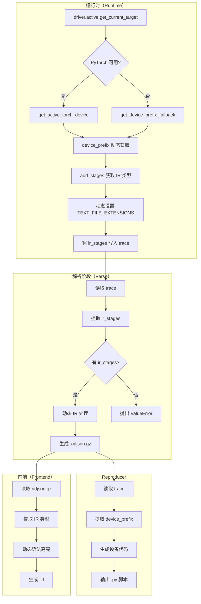
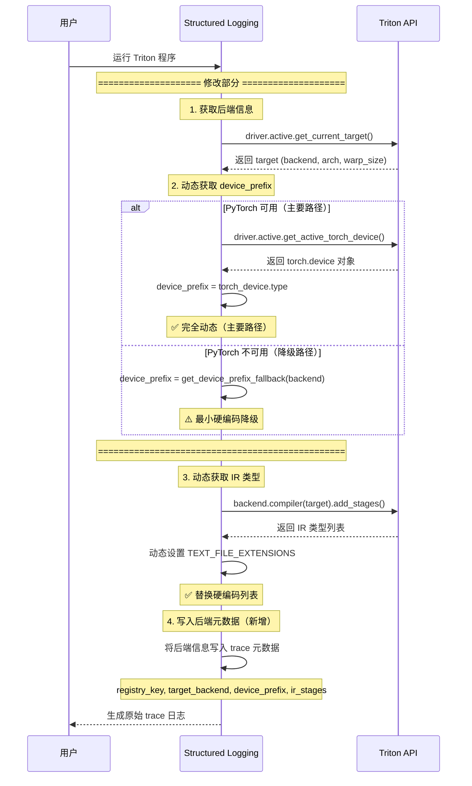
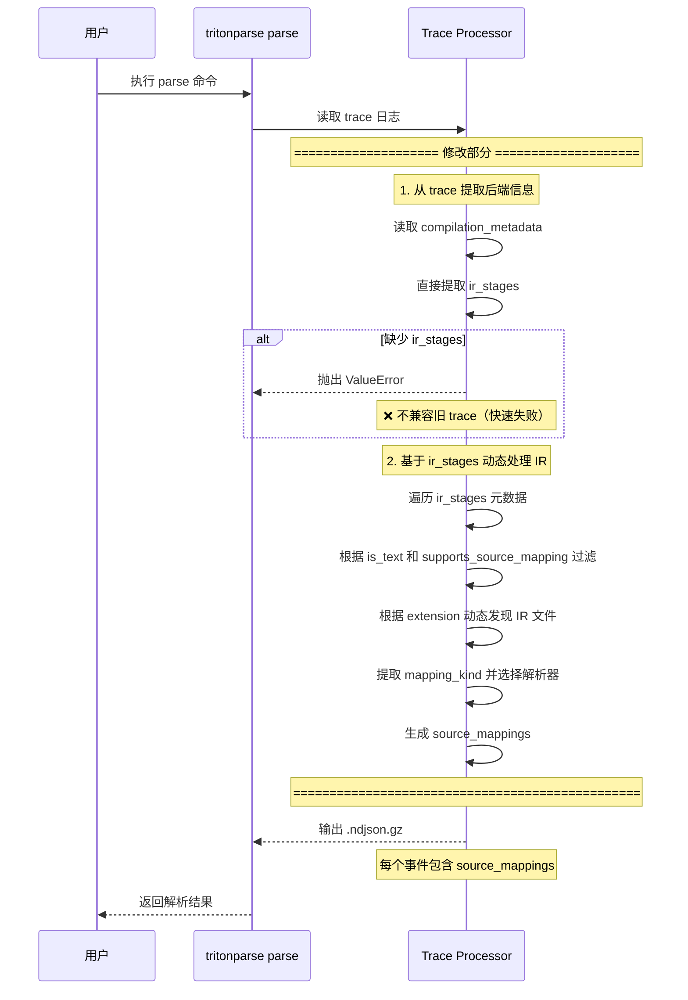
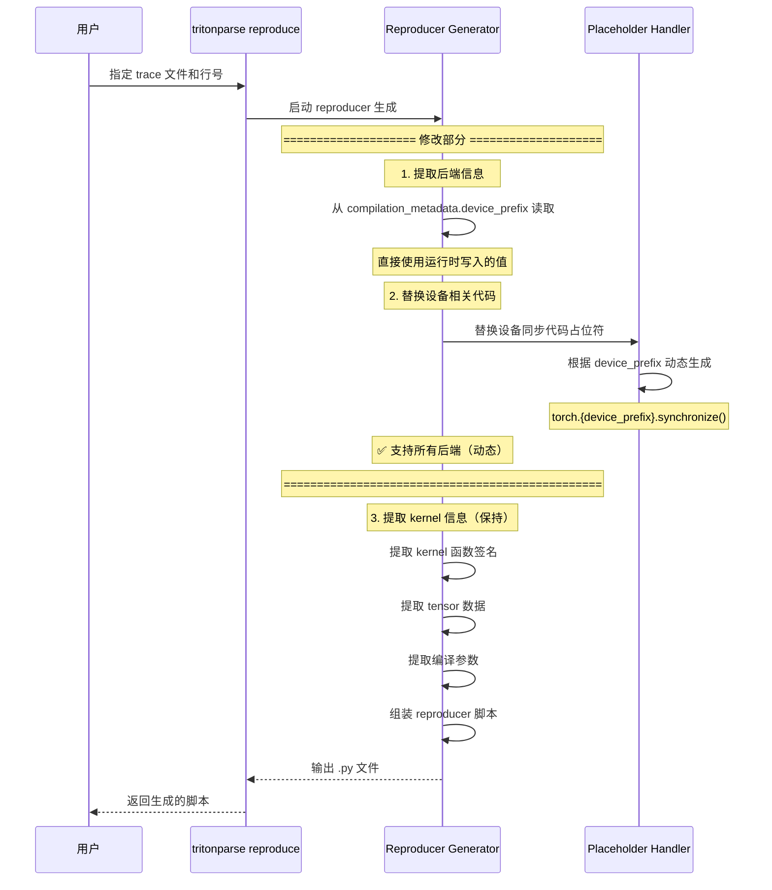

# RFC: TritonParse 通用后端支持

**状态**: [草稿](https://github.com/pytorch/rfcs/labels)
**作者**: @zhudada0120
**创建时间**: 2026-03-31

## 摘要

本 RFC 提出了一种元数据驱动的 TritonParse 架构，消除硬编码的后端假设，使其能够支持 NVIDIA、AMD、Ascend 及未来的 Triton 后端，无需修改代码。核心设计围绕 `ir_stages` 元数据结构，该结构描述后端能力，允许解析器动态发现和处理任何后端的 IR 类型。

## 动机

### 当前问题

TritonParse 包含大量关于特定后端 IR 类型和设备 API 的硬编码假设：

```python
# 硬编码的 IR 类型列表
TEXT_FILE_EXTENSIONS = [".ttir", ".ttgir", ".llir", ".ptx", ".amdgcn"]

# 硬编码的解析器选择
if stage_name in ["ptx", "amdgcn"]:
    parser = AssemblyParser()
elif stage_name.endswith("ir"):
    parser = GenericParser()
```

每个新后端都需要修改多个文件：
- **NVIDIA**: `ttir`, `ttgir`, `ptx` → `torch.cuda`
- **AMD**: `ttir`, `ttgir`, `amdgcn` → `torch.cuda`
- **Ascend**: `ttir`, `ttadapter`, `bcmlir` → `torch.npu`

### 影响

如今添加新后端需要：
1. 在多个位置修改 IR 类型列表
2. 添加解析器选择逻辑
3. 更新设备特定代码生成
4. 更新前端 UI 组件

这产生了高昂的维护成本，无法扩展到未来的后端。

### 提议的解决方案

通过引入元数据驱动的架构，后端通过 `ir_stages` 元数据声明其能力，TritonParse 可以：
- 在运行时动态发现 IR 类型
- 自动选择合适的解析器
- 生成设备特定代码而无需硬编码
- 支持未来的后端而无需代码更改

## 提议的实现

### 架构概览



### 1. 三层后端标识符

我们为不同场景定义三种标识符类型：

```python
{
    "registry_key": "nvidia",     # Triton 后端注册表键
    "target_backend": "cuda",      # 编译目标
    "device_prefix": "cuda",       # PyTorch 设备命名空间
}
```

| 标识符 | 来源 | 用途 | 示例 |
|--------|------|------|------|
| `registry_key` | `triton.backends.backends` | 访问后端对象 | `"nvidia"`, `"amd"`, `"ascend"` |
| `target_backend` | `target.backend` | Triton 编译 | `"cuda"`, `"hip"`, `"npu"` |
| `device_prefix` | PyTorch 设备类型 | 前端 API、reproducer | `"cuda"`, `"cuda"`, `"npu"` |

**实现**（`tritonparse/backends.py`）：
```python
def get_registry_key(target_backend: str) -> str:
    mapping = {"cuda": "nvidia", "hip": "amd", "npu": "ascend"}
    return mapping.get(target_backend, target_backend)

def get_device_prefix_fallback(backend: str) -> str:
    mapping = {"cuda": "cuda", "hip": "cuda", "npu": "npu"}
    return mapping.get(backend, backend)
```

### 2. IR 阶段能力元数据

每个 IR 阶段由四个能力字段描述：

```python
stage_info = {
    "name": "ttir",
    "extension": ".ttir",
    "is_text": True,
    "supports_source_mapping": True,
    "mapping_kind": "generic",  # 解析器类型: "generic" | "ptx" | "sass" | "none"
}
```

**解析器类型**：
- `"generic"`：Triton IR 的通用解析器（TTIR、TTGIR、TTAdapter、BCMLIR）
- `"ptx"`：PTX/AMDGCN 汇编解析器
- `"sass"`：SASS 汇编解析器
- `"none"`：二进制文件，无源码映射

### 3. 运行时：动态后端发现

**位置**：`tritonparse/structured_logging.py`

**核心函数**：`init_backend_metadata()`

**执行流程**：



**实现代码**：

```python
def init_backend_metadata():
    """发现后端能力并写入 ir_stages 元数据。"""
    global _BACKEND_METADATA, _IR_STAGES, TEXT_FILE_EXTENSIONS

    try:
        from triton.runtime import driver
        from triton.backends import backends

        # 获取当前后端
        active_driver = driver.active
        target = active_driver.get_current_target()

        # 动态 device_prefix 检测
        try:
            torch_device = active_driver.get_active_torch_device()
            device_prefix = torch_device.type
        except (ImportError, AttributeError):
            device_prefix = get_device_prefix_fallback(target.backend)

        # 获取 registry key
        registry_key = get_registry_key(target.backend)

        # 通过 add_stages() 发现 IR 阶段
        backend_obj = backends[registry_key]
        compiler = backend_obj.compiler(target)
        options = compiler.parse_options({})
        stages = {}
        compiler.add_stages(stages, options, Language.TRITON)

        # 构建 ir_stages 元数据
        ir_stages = []
        for stage_name in stages.keys():
            mapping_kind = _infer_mapping_kind(stage_name)
            is_text = mapping_kind != "none"
            supports_source_mapping = is_text

            stage_info = {
                "name": stage_name,
                "extension": f".{stage_name}",
                "stage_origin": "backend",
                "is_text": is_text,
                "supports_source_mapping": supports_source_mapping,
                "mapping_kind": mapping_kind,
            }
            ir_stages.append(stage_info)

        # 动态 TEXT_FILE_EXTENSIONS
        TEXT_FILE_EXTENSIONS[:] = [
            stage_info["extension"]
            for stage_info in ir_stages
            if stage_info["is_text"]
        ] + [".json"]

        _BACKEND_METADATA = {
            "registry_key": registry_key,
            "target_backend": target.backend,
            "device_prefix": device_prefix,
            "target": {
                "backend": target.backend,
                "arch": target.arch,
                "warp_size": target.warp_size,
            },
            "ir_stages": ir_stages,
        }

    except Exception as e:
        log.error(f"Failed to initialize backend metadata: {e}")
        _BACKEND_METADATA = None
```

**已知限制**：`_infer_mapping_kind()` 使用硬编码规则，因为 Triton 的 `add_stages()` API 不提供此元数据。这是**唯一剩余的硬编码逻辑**：

```python
def _infer_mapping_kind(stage_name: str) -> str:
    binary_stages = ["npubin", "mlirbc", "cubin", "sass"]
    if stage_name.lower() in binary_stages:
        return "none"
    elif stage_name in ["ptx", "amdgcn"]:
        return "ptx"
    elif stage_name.endswith("ir") or stage_name.startswith("tt"):
        return "generic"
    else:
        return "none"
```

### 4. 解析阶段：元数据驱动的 IR 处理

**位置**：`tritonparse/parse/trace_processor.py`

**执行流程**：



**关键更改**：

1. **从元数据中提取 `mapping_kind`**：
```python
for stage in ir_stages:
    stage_name = stage["name"]
    extension = stage["extension"]
    is_text = stage["is_text"]
    supports_source_mapping = stage["supports_source_mapping"]
    mapping_kind = stage["mapping_kind"]  # 提取解析器类型
    ir_keys_and_maps.append((stage_name, ir_key, mapping_kind))
```

2. **将 `mapping_kind` 传递给解析器**：
```python
def process_ir(
    key: str,
    file_content: Dict[str, str],
    file_path: Dict[str, str],
    other_mappings: List[Any] | None = None,
    mapping_kind: str | None = None,
):
    if mapping_kind is None:
        # 降级：从文件名提取
        mapping = generate_source_mappings(ir_content, key.split(".")[1], other_mappings)
    else:
        # 元数据驱动
        mapping = generate_source_mappings(ir_content, mapping_kind, other_mappings, use_mapping_kind=True)
```

3. **基于 `mapping_kind` 选择解析器**：
```python
def generate_source_mappings(
    ir_content: str,
    ir_type_or_mapping_kind: str,
    other_mappings: List[Any] | None = None,
    use_mapping_kind: bool = False,
):
    if use_mapping_kind:
        # 元数据驱动的解析器选择
        if ir_type_or_mapping_kind == "ptx":
            return extract_ptx_amdgcn_mappings(ir_content, other_mappings, "ptx")
        elif ir_type_or_mapping_kind == "sass":
            return extract_sass_mappings(ir_content)
        elif ir_type_or_mapping_kind == "none":
            return {}
        else:  # "generic"
            # 继续使用 generic loc 解析
            pass
    else:
        # 传统的基于 ir_type 的选择（降级）
        if ir_type_or_mapping_kind == "ptx" or ir_type_or_mapping_kind == "amdgcn":
            return extract_ptx_amdgcn_mappings(ir_content, other_mappings, ir_type_or_mapping_kind)
        # ...
```

### 5. Reproducer：设备无关代码生成

**位置**：`tritonparse/reproducer/placeholder_replacer.py`

**执行流程**：



**实现代码**：

从元数据中提取 `device_prefix`：

```python
def _infer_execution_device(context_bundle: ContextBundle) -> str:
    compilation_metadata = raw_launch_event.get("compilation_metadata", {})
    device_prefix = compilation_metadata.get("device_prefix")
    return device_prefix

def _build_synchronize_snippet(context_bundle: ContextBundle) -> str:
    device_prefix = _infer_execution_device(context_bundle)
    return f"torch.{device_prefix}.synchronize()"
```

### 6. 前端：元数据驱动的 UI

**位置**：`website/src/utils/syntaxHighlight.ts`

```typescript
export function selectHighlighterByMappingKind(
    kernel: ProcessedKernel,
    irType: string
): string {
    const stageInfo = kernel.metadata?.ir_stages?.find(s => s.name === irType);
    
    if (!stageInfo) return inferSyntaxHighlighter(irType);

    switch (stageInfo.mapping_kind) {
        case 'generic': return 'mlir';
        case 'ptx': return 'asm';
        case 'sass': return 'asm';
        default: return 'text';
    }
}
```

## 元数据结构

### compilation_metadata

在运行时写入 trace 文件：

```json
{
  "registry_key": "ascend",
  "target_backend": "npu",
  "device_prefix": "npu",
  "target": {
    "backend": "npu",
    "arch": "Ascend910B4",
    "warp_size": 0
  },
  "ir_stages": [
    {
      "name": "ttir",
      "extension": ".ttir",
      "stage_origin": "backend",
      "is_text": true,
      "supports_source_mapping": true,
      "mapping_kind": "generic"
    },
    {
      "name": "ttadapter",
      "extension": ".ttadapter",
      "is_text": true,
      "supports_source_mapping": true,
      "mapping_kind": "generic"
    },
    {
      "name": "npubin",
      "extension": ".npubin",
      "is_text": false,
      "supports_source_mapping": false,
      "mapping_kind": "none"
    }
  ]
}
```

## 扩展点：如何添加新后端

本 RFC 实现显著降低了添加新后端的成本。以下是添加新 Triton 后端到 TritonParse 的流程：

### 新后端支持流程

1. **实现 Triton 后端接口**
   - 继承 `BaseBackend` 和 `BaseCompiler`
   - 实现 `add_stages()` API，声明所有 IR 阶段
   - 示例（Ascend 后端）：
   ```python
   class AscendCompiler(BaseBackend):
       def add_stages(self, stages, options, language):
           stages["ttir"] = self.parse_ttir
           stages["ttadapter"] = self.parse_ttadapter
           stages["bcmlir"] = self.parse_bcmlir
           stages["npubin"] = self.compile_to_binary
   ```

2. **更新 `mapping_kind` 推断规则**（唯一需要修改 TritonParse 的地方）
   - 位置：`tritonparse/structured_logging.py`
   - 添加新 IR 类型的推断规则
   ```python
   def _infer_mapping_kind(stage_name: str) -> str:
       # 现有规则...
       elif stage_name in ["ptx", "amdgcn"]:
           return "ptx"
       # 为新后端添加规则
       elif stage_name in ["your_custom_ir"]:
           return "generic"  # 或 "ptx", "sass", "none"
   ```

3. **运行时自动发现**
   - TritonParse 自动调用 `add_stages()`
   - 自动生成 `ir_stages` 元数据
   - 无需修改 IR 处理流程

4. **自动适配**
   - 解析阶段自动处理新 IR 类型
   - Reproducer 自动生成设备特定代码
   - 前端自动适配 UI

### 对比：添加新后端的工作量

| 任务 | 旧方式（硬编码） | 新方式（元数据驱动） |
|------|-----------------|---------------------|
| 修改 IR 类型列表 | 5+ 处 | 1 处（推断规则） |
| 添加解析器选择逻辑 | 每个新类型都要添加 | 自动适配 |
| 更新设备代码生成 | 手动添加 | 自动生成 |
| 更新前端 UI | 手动添加 | 自动适配 |
| 总代码修改量 | ~200 行 | ~10 行 |

### 示例：Ascend NPU 后端

通过本 RFC，添加 Ascend NPU 支持只需要：

1. **Triton 后端实现**（Ascend 团队负责）：
   - 实现 `AscendCompiler` 类
   - 在 `add_stages()` 中声明阶段

2. **TritonParse 适配**（10 行代码）：
   ```python
   # tritonparse/structured_logging.py
   def _infer_mapping_kind(stage_name: str) -> str:
       # ... 现有规则 ...
       # 为 Ascend 添加规则
       elif stage_name in ["bcmlir", "ttadapter"]:
           return "generic"
       elif stage_name == "npubin":
           return "none"
   ```

3. **自动获得**：
   - ✅ IR 文件自动发现和处理
   - ✅ `torch.npu.synchronize()` 生成
   - ✅ 前端语法高亮支持
   - ✅ 所有其他 TritonParse 功能

## 缺点

### 1. 破坏性更改

不支持没有 `ir_stages` 元数据的旧 trace 文件。用户必须使用兼容版本的 tritonparse 重新生成 trace。

**缓解措施**：清晰的错误消息指导用户重新生成 trace。

### 2. 一个剩余的硬编码位置

`structured_logging.py` 中的 `_infer_mapping_kind()` 函数仍然使用硬编码规则从阶段名称推断解析器类型。

**影响**：具有异常阶段命名的新后端可能需要更新此推断逻辑。

**未来解决方案**：扩展 Triton 的 `add_stages()` API 以直接从后端包含 `mapping_kind` 元数据。


## 替代方案

### 替代方案 1：配置驱动的方法

在外部配置文件（JSON/YAML）中定义后端能力。

**优点**：
- 新后端无需 Python 代码更改
- 非开发人员更容易添加后端

**缺点**：
- 需要维护单独的配置文件
- 配置与实际后端能力不同步
- 类型安全性较差

### 替代方案 2：Triton 后端 API 扩展

修改 Triton 的后端接口，通过新的 `get_ir_stages_metadata()` API 提供完整的元数据。

**优点**：
- 消除所有硬编码推断
- 最原则性的长期解决方案

**缺点**：
- 需要更改 Triton 核心
- 短期内不可行
- 需要跨多个团队协调


## 实现状态

| 组件 | 状态 | 备注 |
|-----------|--------|-------|
| 运行时元数据生成 | ✅ 已实现 | `structured_logging.py` |
| 解析阶段元数据使用 | ✅ 已实现 | `trace_processor.py` |
| Reproducer 设备检测 | ✅ 已实现 | `placeholder_replacer.py` |
| 前端元数据驱动 UI | ✅ 已实现 | `syntaxHighlight.ts` |
| 后端工具 | ✅ 已实现 | `backends.py` |
| Ascend NPU 支持 | ✅ 已实现 | 通过 RFC 添加的第一个后端 |
| 文档 | ✅ 已实现 | 本 RFC |


## 附录：文件修改

### 修改的文件

| 文件 | 更改 | 状态 |
|------|---------|--------|
| `tritonparse/structured_logging.py` | 添加 `init_backend_metadata()`，动态 `TEXT_FILE_EXTENSIONS` | ✅ |
| `tritonparse/parse/trace_processor.py` | 使用来自元数据的 `mapping_kind` | ✅ |
| `tritonparse/reproducer/placeholder_replacer.py` | 从元数据提取 `device_prefix` | ✅ |
| `tritonparse/backends.py` | 添加后端工具函数 | ✅ |
| `website/src/utils/syntaxHighlight.ts` | 元数据驱动的高亮器选择 | ✅ |
| `website/src/utils/dataLoader.ts` | 添加 `IRStageInfo` 接口 | ✅ |

### 新文件

| 文件 | 用途 |
|------|---------|
| `tests/test_backend_agnostic_integration.py` | 元数据流的集成测试 |
| `tests/test_ascend_backend.py` | Ascend NPU 后端验证 |
